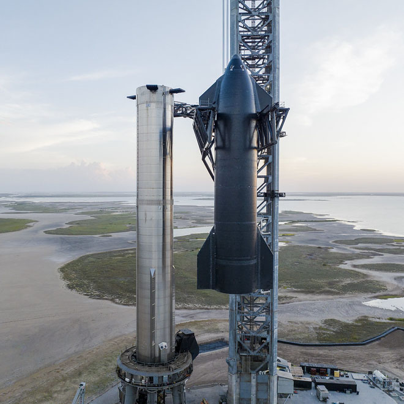
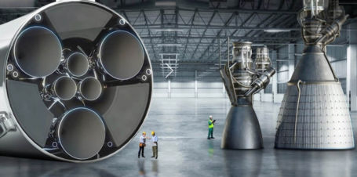
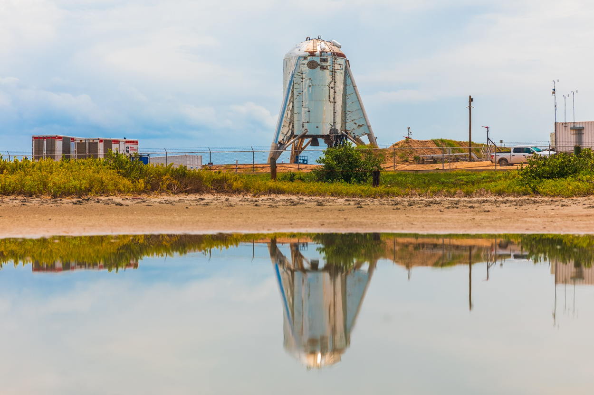
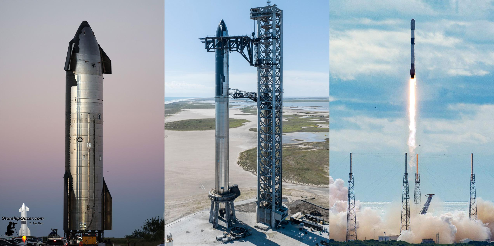
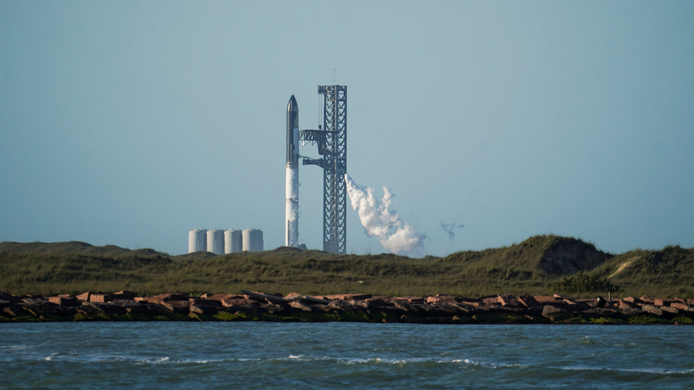

# 深度解析 Space X 星舰计划'

## SpaceX星舰计划概述

SpaceX 的星舰计划代表了人类太空探索的新纪元，旨在通过一系列技术创新和大胆设想，将人类的足迹拓展至火星及其他深空目的地。星舰（Starship）作为这一宏伟计划的旗舰，不仅是人类历史上最大的火箭，也是可重复使用技术的典范，预示着太空旅行成本的大幅降低和效率的显著提升。

### 基本背景与目标

星舰计划由 SpaceX 公司的创始人埃隆·马斯克（Elon Musk）提出，其核心目标是在 2050 年前将 100 万人送上火星，建立一个可持续的人类定居点。这一目标不仅需要克服技术上的重重障碍，还需解决包括生命支持系统、辐射防护、重力适应等在内的多个科学难题。星舰的设计正是为了应对这些挑战，它采用先进的推进技术，能够在地球与火星之间进行多次往返，每次任务都能携带大量物资和人员。

### 战略意义

星舰计划的战略意义远不止于技术突破，它还承载着人类对未来的美好愿景。通过实现太空旅行的商业化和常态化，SpaceX 希望激发全球对太空探索的热情，促进科技发展，同时也为地球面临的人口过剩、资源枯竭等问题提供新的解决方案。星舰的可重复使用性是这一愿景的关键，它能够大幅降低每次太空任务的成本，使得更广泛的太空探索和商业活动成为可能。

### 技术突破

在星舰计划中，最引人注目的技术突破之一是其可重复使用的技术。传统的火箭在完成任务后通常会被抛弃，而星舰的设计允许其在返回地球后经过简单的维护即可再次发射，这不仅极大地降低了太空旅行的成本，也提高了任务的灵活性和频率。此外，星舰还采用了甲烷燃料，相比传统的液氧煤油推进剂，甲烷燃料的生产更为环保，且在火星上更容易获得，这为星舰的长期运营提供了重要的能源保障。

SpaceX 的星舰计划不仅是技术的飞跃，更是人类探索未知世界的勇敢尝试。随着计划的逐步推进，我们有理由相信，未来的太空旅行将变得更加普及，人类在宇宙中的足迹也将更加深远。

---

## 星舰设计与技术架构

星舰的设计与技术架构是Space X实现其宏伟目标的关键。星舰不仅是人类历史上最大的火箭，也是技术上的巨大飞跃，其设计特点和技术选择都围绕着一个核心目标：实现全箭可重复使用，从而大幅降低太空旅行的成本。

### 材料选择

星舰采用不锈钢材料作为其主要结构材料，这与传统的航天器使用的碳纤维复合材料或铝合金截然不同。不锈钢的使用不仅因为其成本效益高，还因为它在极端温度下的稳定性能。不锈钢在低温下不会变脆，而在高温下也能保持其强度，这对于星舰在地球和太空间的往返至关重要。

### 推进系统

星舰的推进系统是其技术架构中的亮点之一。它装备了Space X自主研发的猛禽发动机，这些发动机使用液氧甲烷作为推进剂。与传统的液氧煤油燃料相比，甲烷不仅燃烧更为清洁，而且可以更容易地在火星表面生产，这对于未来在火星上的持续运营具有重要意义。

### 燃料类型

选择甲烷作为燃料不仅是因为其燃烧效率高，更重要的是其在火星上的可再生性。Space X的计划中包括在火星上建立甲烷生产设施，通过利用火星大气中的二氧化碳和地下冰层中的水，通过电解和萨巴蒂尔反应生产甲烷和氧气。这一创新解决了太空探索中最基本的燃料供应问题，为长期的火星任务提供了可能。

### 全箭可重复使用

星舰的设计考虑了全箭可重复使用的每一个细节，从发动机的耐用性设计到着陆系统的精准控制。星舰的着陆是通过其自身的发动机反推实现的，这需要精确的控制和强大的计算能力。通过不断的技术迭代和测试，Space X正在逐步提高星舰的可靠性和可重复使用性，这是降低太空旅行成本、实现火星移民目标的关键。

通过这些先进的设计和技术，Space X的星舰计划正朝着实现人类历史上最伟大的太空探索目标迈进。

---

## 测试历程与关键里程碑

星舰计划的测试历程充满了挑战与创新，从早期的原型机 Starhopper 到如今接近最终形态的完整版星舰，每一步都凝聚了 SpaceX 团队对航天技术的不懈追求。

### Starhopper：星舰的萌芽

Starhopper 是星舰计划的早期原型，主要用于测试 SpaceX 新开发的 Raptor 发动机和不锈钢制造材料的性能。2019 年 7 月，Starhopper 完成了首次自由飞行测试，虽然只有 20 米高，但它证明了不锈钢设计在高温高压环境下的可行性，为后续设计提供了宝贵的数据支持。

### Starship Mk1 和 Mk2：迈向完整

随着 Starhopper 成功完成测试，SpaceX 开始建造更加复杂的原型机 Starship Mk1 和 Mk2。2020 年 2 月，Mk1 在一次压力测试中发生爆炸，虽然这次失败带来了技术上的挫折，但也揭示了设计中的潜在问题，促使团队对燃料罐的设计进行了改进。这些改进在后续的原型机中得到了应用，显著提高了整体的稳定性和安全性。

### SN8 至 SN15：飞向天空

从 SN8（Serial Number 8）到 SN15，星舰原型机的测试逐渐接近实际飞行任务的要求。2020 年 12 月，SN8 成功完成了 12.5 公里的高空测试飞行，尽管在着陆时发生了爆炸，但这次飞行验证了多项关键技术，包括空中翻转、精确降落等。随后的 SN9 和 SN10 也连续遭遇着陆失败，但每次失败都带来了新的技术突破。直到 2021 年 5 月，SN15 成功完成了 10 公里的高空飞行并安全着陆，标志着星舰计划取得了重大进展。

### 未来展望：从地球到火星

通过不断的测试和迭代，星舰计划已经从一个概念逐步转变为现实。尽管面临诸多挑战，但 SpaceX 通过每一次的成功与失败，不断优化设计和技术，为最终实现火星移民奠定了坚实的基础。未来，星舰不仅将用于深空探索，还将承担起商业运输、轨道服务等多种任务，开启人类航天的新纪元。

---

## 未来应用场景与挑战

星舰的未来应用场景与挑战

星舰，SpaceX 旗下的超级重型运载火箭，不仅在尺寸上创下了历史纪录，其未来应用场景也令人瞩目。从月球和火星的殖民项目，到卫星部署及全球快速货运，星舰的潜力几乎无限。然而，这些宏大的愿景背后，隐藏着技术、法规及成本等多方面的挑战。

在月球和火星殖民方面，星舰是实现马斯克宏伟愿景的关键。马斯克计划在2050年前将100万人送上火星，这一目标不仅需要强大的运输工具，还需要解决诸如辐射防护、低重力环境下的健康维持以及建立自给自足的生态系统等技术难题。星舰的设计旨在重复使用，大幅降低了每次任务的成本，这是实现大规模移民计划不可或缺的条件。

卫星部署是星舰的另一大应用场景。随着全球对卫星通信、地球观测及导航系统需求的不断增长，快速、经济高效地将卫星送入轨道变得尤为重要。星舰的强大运载能力和低成本发射能力，为满足这一需求提供了可能。此外，星舰的灵活性使其能够适应不同轨道和卫星类型的发射需求，进一步增强了其市场竞争力。

全球快速货运是星舰探索的新兴领域。通过利用星舰快速穿越大气层的能力，理论上可以在几小时内实现地球上任意两点之间的货物运输，这将彻底改变全球物流行业。然而，这一构想的实现不仅需要克服技术上的障碍，还需要面对国际法规的限制，尤其是在飞行路径规划、空域使用和安全标准等方面。

尽管面临重重挑战，星舰的开发和应用仍然是人类探索宇宙、推动科技进步的重要一步。随着技术的不断进步和相关政策的完善，我们有理由相信，星舰将在未来的太空探索和地球应用中发挥更加重要的作用。

---

## 竞争格局与行业影响

在探讨 SpaceX 星舰计划的竞争格局与行业影响时，我们不可避免地要将其与蓝色起源（Blue Origin）和联合发射联盟（United Launch Alliance, ULA）等商业航天公司以及国家航天机构进行对比。这些公司在技术路线、市场定位和长期愿景上各有千秋，但星舰计划以其前所未有的规模和雄心，正逐步改变全球航天产业的面貌。

SpaceX 的星舰是人类历史上最大的火箭，设计用于执行深空任务，包括最终实现火星移民。马斯克的愿景不仅仅是技术上的突破，更是对人类未来的重新构想。星舰计划的核心在于其可重复使用的技术，这显著降低了太空旅行的成本，使得火星移民等远大目标变得更为现实。然而，火星移民面临的主要挑战依然严峻，包括长时间太空旅行中的辐射暴露、重力变化对人体的影响，以及建立自给自足生态系统的技术难题。

相比之下，蓝色起源的 New Glenn 火箭虽然也是为商业卫星发射和潜在的载人任务设计，但其规模和技术特点与星舰有所不同。New Glenn 旨在提供可靠的商业发射服务，而星舰则更多地聚焦于探索和殖民。联合发射联盟则通过其 Atlas 和 Delta 系列火箭，长期服务于美国政府和商业客户，但其技术路线较为传统，缺乏星舰那样的革命性创新。

星舰计划对全球航天产业的颠覆性影响体现在多个方面。首先，通过大幅降低进入太空的成本，星舰有可能开启一个全新的商业太空时代，激发新的商业模式和技术创新。其次，星舰的开发和成功发射将推动相关技术的快速发展，如材料科学、推进技术以及自动控制等，这些技术的突破不仅限于航天领域，还将广泛应用于其他行业。最后，星舰计划的长远目标——火星移民，虽然充满挑战，但对人类的未来具有深远意义，它激发了全球对太空探索的热情，促进了国际间的技术合作与交流。

综上所述，SpaceX 的星舰计划不仅是一项技术上的壮举，更是对人类未来的一次深刻探索。随着星舰计划的推进，其对全球航天产业乃至整个社会的影响将日益显现。

> *(配图失败: SpaceX Starship)*

---

## 公众争议与伦理思考

随着 SpaceX 星舰计划的推进，公众对其环保影响、太空资源分配以及私营企业主导太空探索的伦理问题展开了激烈的讨论。星舰作为人类历史上最大的火箭，不仅承载着马斯克将 100 万人送上火星的愿景，也引发了广泛的社会争议。

首先，在环保方面，星舰的发射和运行对地球环境的影响成为了公众关注的焦点。火箭发射过程中产生的大量废气和噪音污染，以及火箭残骸对海洋生态系统的潜在威胁，都引发了环保组织和科学家的担忧。尽管 SpaceX 表示正在努力减少这些负面影响，但如何平衡科技进步与环境保护仍然是一个亟待解决的问题。

其次，太空资源的分配问题也逐渐浮出水面。随着越来越多的私营企业加入太空探索，如何公平、合理地分配有限的太空资源，避免太空垃圾的产生，确保所有国家和企业都能从太空探索中受益，成为国际社会需要共同面对的挑战。星舰计划的成功，无疑将加剧这一问题的复杂性。

最后，私营企业主导太空探索引发的社会伦理讨论也不容忽视。马斯克的火星移民计划，虽然充满未来感和创新精神，但其背后的伦理问题不可忽视。火星移民面临的主要挑战包括辐射、重力和自给自足的生态系统建设，这些问题不仅关系到移民者的生存，也涉及到人类探索太空的道德边界。此外，私营企业控制太空探索的资源和技术，可能会加剧社会不平等，影响全球合作与和平。

综上所述，SpaceX 的星舰计划在推动人类走向星辰大海的同时，也带来了环保、资源分配和伦理等多方面的挑战。面对这些挑战，需要国际社会共同努力，制定合理的规则和标准，确保太空探索的可持续性和公平性。

---

