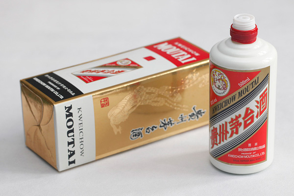
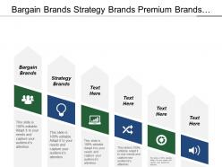
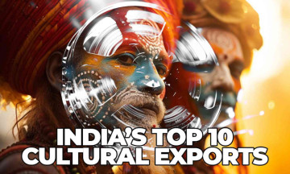
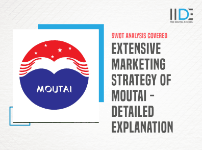

# 茅台和林德时代公司的战略区别

## 引言：茅台与宁德时代的行业背景与市场定位

在当今的商业世界中，茅台与宁德时代分别代表了两个截然不同的行业领域，一个是传统白酒行业的领头羊，另一个则是新能源科技的先锋。茅台，以其悠久的历史和深厚的文化底蕴，不仅是中国的国家名片，也是全球高端白酒市场的代表。自1915年荣获巴拿马万国博览会金奖以来，茅台酒以其独特的酿造工艺和卓越的品质，赢得了国内外消费者的广泛认可。茅台的成功，很大程度上得益于其对传统工艺的坚持和品牌价值的不断挖掘。

相比之下，宁德时代则是在全球新能源革命浪潮中崛起的新星。作为全球领先的新能源创新科技公司，宁德时代专注于新能源汽车动力电池系统、储能系统的研发、生产和销售。自2011年成立以来，宁德时代凭借其先进的电池技术和高效的生产能力，迅速占据了市场领先地位，成为推动全球能源转型的关键力量。宁德时代不仅在国内市场上遥遥领先，其产品和服务也已覆盖全球多个主要市场，展现出强大的国际竞争力。

这两个企业在行业背景、市场定位以及战略发展方向上存在着本质的差异。茅台注重的是传承与创新的结合，致力于在保持传统工艺的同时，通过现代化的管理和营销手段，扩大品牌影响力；而宁德时代则更侧重于技术创新和市场拓展，不断追求在新能源领域的突破，引领行业的发展趋势。这种差异不仅体现在产品和服务上，更体现在企业文化、管理理念以及对未来的展望上。

通过对比茅台与宁德时代，我们可以更深刻地理解传统产业与新兴产业的不同特点，以及它们在全球化背景下的竞争与合作。这种对比不仅有助于我们认识两个行业的现状，也为探索未来的商业趋势提供了有价值的视角。

---

## 核心战略差异：存量深耕 vs 增量突围

在当今快速变化的商业环境中，不同企业的战略选择往往决定了其市场地位和未来发展。茅台和宁德时代作为各自领域的领军者，其战略选择的差异尤为显著，分别体现了存量深耕与增量突围的两种不同路径。

### 茅台：品牌溢价与渠道管控的保守型战略

茅台，作为中国白酒行业的标杆企业，其战略核心在于品牌价值的持续建设和渠道的精细管理。茅台的品牌溢价能力强大，这不仅源于其悠久的历史和独特的酿造工艺，更依赖于其在高端市场的精准定位。茅台通过严格控制产量，确保产品的稀缺性，从而维持其市场价值。此外，茅台对销售渠道的严格管控也是其成功的关键。通过与核心经销商建立稳定的合作关系，茅台不仅确保了产品的流通效率，也有效防止了价格波动和市场混乱，维护了品牌形象和市场秩序。

### 宁德时代：技术迭代与产能扩张的进攻型战略

相比之下，宁德时代作为全球领先的锂离子电池制造商，其战略重点在于技术创新和市场拓展。宁德时代通过持续的技术研发，不断推出性能更优、成本更低的电池产品，以满足市场日益增长的需求。特别是在电动汽车和储能领域，宁德时代的技术优势明显，通过与多家国际知名车企建立战略合作关系，迅速扩大市场份额。此外，宁德时代还通过大规模的产能扩张，提高生产效率，降低单位成本，进一步增强了其市场竞争力。这种以技术为驱动、以市场为导向的战略，使宁德时代在全球新能源电池市场中占据了领先地位。

### 结语

茅台和宁德时代的战略选择反映了不同行业和市场环境下的不同应对策略。茅台通过品牌溢价和渠道管控，稳固了其在高端白酒市场的地位；而宁德时代则通过技术迭代和产能扩张，实现了在新能源电池领域的快速发展。这两种战略各有千秋，但都体现了企业在面对市场挑战时的智慧和决心。

---

## 研发投入与创新路径对比

在探讨茅台与宁德时代的战略区别时，研发投入与创新路径的差异显得尤为关键。这两家企业分别代表了传统工艺与现代技术的两种不同发展模式，它们的研发策略和创新路径反映了各自行业的特点和未来发展方向。

茅台，作为中国白酒行业的领军企业，其研发模式主要围绕工艺传承与有限创新展开。茅台酒的酿造工艺历史悠久，包括近百道工序，每一步都蕴含着深厚的文化底蕴和精湛的手工技艺。茅台的研发重点在于如何在保持传统工艺的前提下，通过有限的技术创新提升产品质量和生产效率。例如，通过改进发酵技术、优化原料选择、提高环境控制能力等手段，茅台力求在传统与现代之间寻找平衡点，确保每一瓶茅台酒都能保持其特有的品质和风味。

相比之下，宁德时代作为全球领先的新能源科技企业，其创新体系则更加注重高研发投入和专利布局。宁德时代的研发活动集中在前沿技术领域，如新材料、电池管理系统、储能技术等。通过持续的高研发投入，宁德时代不仅在电池能量密度、安全性、成本控制等方面取得了显著进展，还在全球范围内建立了广泛的专利保护网，为其技术领先优势提供了坚实的法律保障。此外，宁德时代还积极参与国内外标准的制定，通过技术标准的影响力进一步巩固其行业领导地位。

茅台与宁德时代的创新路径虽然迥异，但都体现了各自在特定行业背景下的战略智慧。茅台通过对传统工艺的坚守和有限创新，保持了其产品的独特性和市场竞争力；而宁德时代则通过高强度的研发投入和技术突破，引领了新能源行业的技术进步和发展方向。两者不同的研发模式和创新路径，不仅塑造了各自的品牌形象，也为行业内的其他企业提供了宝贵的参考和启示。

---

## 全球化战略的差异化实施

在全球化战略的实施过程中，茅台和宁德时代展现了截然不同的路径，这两条路径不仅反映了两家企业各自的核心优势，也体现了中国企业在国际舞台上日益多样化的发展模式。

茅台，作为中国白酒行业的领军者，其全球化战略的核心在于文化输出。茅台不仅仅是在海外销售其产品，更重要的是在推广中国白酒文化，以及与之相关的中国传统文化。通过在国际重大活动中的亮相，茅台成功地将中国白酒的文化价值传递给世界，增强了品牌的国际认知度。茅台的海外拓展策略，更多地是基于情感和文化共鸣，旨在建立一个长期的品牌形象，而不仅仅是追求短期的市场份额。

相比之下，宁德时代在全球化战略上的布局则更加侧重于技术和标准的输出。作为全球领先的新能源汽车电池供应商，宁德时代通过不断的技术创新和标准制定，积极参与国际市场竞争。宁德时代不仅在产品技术上保持着领先优势，还在全球范围内推动电池技术标准的统一，以增强其在行业中的影响力。这种技术导向的全球化战略，使得宁德时代能够在全球范围内建立起稳固的供应链体系，为更多的国际客户提供高效、可靠的产品和技术支持。

茅台的文化输出型海外拓展和宁德时代的技术标准输出型全球布局，代表了中国企业在全球化进程中不同的探索和实践。这两条路径不仅展示了中国企业的多元化发展策略，也为全球市场带来了更加丰富和多样的产品与文化体验。

---

## 风险应对机制比较

在探讨茅台与宁德时代在风险应对机制上的差异时，我们首先需要理解两者所处的行业背景和面临的挑战。茅台作为中国白酒行业的领军企业，其面临的最大风险在于市场周期性波动和政策调控。而宁德时代，作为新能源电池行业的先锋，其风险则更多地来自于技术快速迭代和国际供应链的稳定性。

### 茅台的防御策略

茅台在应对市场周期性波动时，采取了一系列稳健的防御策略。首先，茅台通过品牌建设和市场的深度渗透，确保了其产品的高端定位和稳定的市场需求。其次，茅台在财务策略上保持了较高的现金流和较低的负债率，这为公司在面对经济下行时提供了充足的缓冲。此外，茅台还通过多元化投资，如房地产和金融领域，以分散单一行业带来的风险。

### 宁德时代的风险对冲手段

相比之下，宁德时代在面对新兴行业的技术变革时，采取了更加积极的风险对冲手段。首先，公司在研发投入上持续增加，确保技术领先优势，通过技术创新来应对技术迭代的挑战。其次，宁德时代在全球范围内建立起多元化的供应链体系，通过与各国供应商建立战略合作关系，减少对单一市场或供应商的依赖。此外，宁德时代还通过参与国际标准制定和专利布局，增强其在全球市场的竞争力和话语权。

### 结论

茅台和宁德时代在风险应对机制上的不同策略，充分反映了传统行业与新兴行业在面对挑战时的差异。茅台的防御策略更多地依赖于品牌价值和市场地位，而宁德时代的风险对冲手段则更侧重于技术创新和全球供应链的优化。这种差异不仅体现了两家企业在战略上的选择，也反映了不同行业在应对市场变化时的特性和需求。

---

## 启示：不同生命周期企业的战略选择

在探讨茅台与林德时代公司的战略区别时，我们可以从成熟型企业与成长型企业的生命周期角度出发，来理解两者的战略制定底层逻辑的差异。这种分析不仅有助于深入了解这两家公司，也对其他跨行业的企业具有重要的借鉴价值。

### 成熟型企业：茅台的战略智慧

茅台作为一家成熟的白酒企业，其市场地位稳固，品牌影响力深远。在这样的背景下，茅台的战略重点更多地放在了维护品牌价值、优化产品结构和提升市场覆盖上。茅台通过严格控制产量，保持产品的高端形象，同时通过多元化投资，减少对单一市场的依赖。这种战略选择，体现了成熟企业在稳定发展基础上寻求可持续增长的智慧。

### 成长型企业：林德时代的战略创新

与茅台不同，林德时代作为一家快速成长的新能源企业，其战略定位更加侧重于技术创新和市场拓展。面对激烈的市场竞争和快速变化的技术环境，林德时代不断加大研发投入，探索新的技术和商业模式，以保持竞争优势。同时，公司积极布局海外市场，寻求新的增长点。这种战略选择，反映了成长型企业在高速发展期对速度和灵活性的追求。

### 跨行业的借鉴价值

无论是茅台的稳健发展还是林德时代的快速创新，背后都体现了企业在不同生命周期阶段对战略选择的深刻思考。成熟型企业通过稳固现有优势，寻求稳健的增长路径；成长型企业则通过不断创新，抓住市场机会，实现快速扩张。这种差异化的战略选择，对其他行业的企业同样具有借鉴意义。

例如，SpaceX 的星舰项目展示了成长型企业如何通过技术创新，打破行业边界，实现跨领域的突破。而 Project Omega 的启动，则表明，在技术飞速发展的今天，即使是成熟企业也必须保持对新技术的敏感度，通过持续创新来应对未来的挑战。这些案例提醒我们，无论企业处于哪个生命周期阶段，持续的战略反思和适时的战略调整都是保持竞争力的关键。

---

