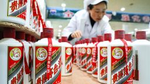
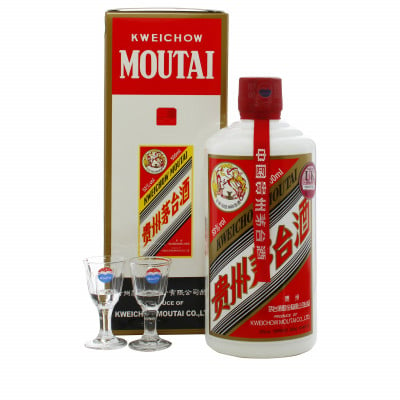
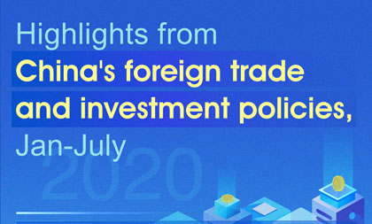

# 茅台和宁德时代的战略区别

## 引言：茅台与宁德时代的行业背景与战略重要性

# 引言：茅台与宁德时代的行业背景与战略重要性

在当今快速变化的商业环境中，企业的战略选择对于其长期发展具有决定性的影响。本章将对比分析中国两家领军企业——贵州茅台与宁德时代，从它们的行业背景出发，探讨两者在战略上的差异及其背后的意义。

## 茅台：传统白酒行业的领头羊

贵州茅台，作为中国白酒行业的佼佼者，其品牌价值和市场地位在中国乃至全球都有着举足轻重的影响。茅台酒以其独特的酿造工艺和深厚的文化底蕴，不仅是中国高端商务活动中的首选，也是国际市场上中国文化的代表性符号之一。茅台的成功，很大程度上归功于其对品牌价值的精心维护和对传统工艺的不断传承与创新。

## 宁德时代：新能源领域的创新先锋

与茅台在传统行业中的地位形成鲜明对比的是，宁德时代在新能源领域的崛起。作为全球领先的动力电池系统提供商，宁德时代通过持续的技术创新和规模化生产，推动了新能源汽车行业的快速发展。在全球追求绿色可持续发展的大背景下，宁德时代不仅满足了市场对高性能电池的需求，还通过其技术进步促进了整个产业链的升级。

## 战略差异的意义

茅台与宁德时代虽然分属不同行业，但两者在各自的领域内均展现了卓越的领导力。茅台的战略重点在于保护和提升品牌价值，以及通过精细化管理和营销策略巩固其市场地位；而宁德时代则更侧重于技术创新和市场扩张，致力于成为全球新能源解决方案的领导者。两种不同的战略反映了两家企业对各自行业特性的深刻理解和对未来发展趋势的精准把握。

通过对比茅台和宁德时代的战略选择，我们可以更全面地理解企业在不同的发展环境和市场条件下，如何制定适合自身特点的发展路径。这不仅对于两家企业本身具有重要的参考价值，也为其他行业的企业提供了宝贵的经验和启示。

在接下来的章节中，我们将深入探讨茅台和宁德时代在战略实施过程中的具体措施及其效果，为读者呈现一个更加完整和深入的分析视角。

---

## 核心战略定位对比

### 核心战略定位对比

在当今的商业世界中，不同行业的企业有着截然不同的战略定位，这些定位决定了它们在市场上的竞争力和发展潜力。茅台和宁德时代是两个在中国乃至全球都具有重要影响力的企业，它们在战略定位上的差异，不仅反映了不同行业的特点，也体现了各自独特的竞争优势。

#### 茅台：奢侈品属性与品牌护城河

茅台是中国最著名的白酒品牌之一，其核心战略定位在于强化奢侈品属性和构建强大的品牌护城河。茅台通过严格控制产量，确保产品的稀缺性和高品质，从而维持其高端品牌形象。这种稀缺性不仅提升了茅台的市场价值，也增强了消费者的购买欲望。此外，茅台还通过深厚的文化底蕴和历史传承，加强了品牌的情感连接，使其成为消费者心中不可替代的奢侈品 [中国茅台官网](https://www.moutai.com)。

茅台的品牌护城河不仅体现在产品本身，还体现在其独特的酿造工艺和严格的品质控制上。这些工艺和控制标准是茅台多年积累的宝贵资产，难以被竞争对手复制。因此，茅台在奢侈品市场的地位非常稳固，其品牌价值和市场份额持续增长。

#### 宁德时代：技术迭代与规模效应

与茅台不同，宁德时代的核心战略定位在于技术迭代和规模效应。作为全球领先的锂离子电池制造商，宁德时代通过不断的技术创新和研发投入，保持了在新能源领域的领先地位。公司拥有一支强大的研发团队，专注于电池材料、电池管理系统和电池包设计等关键技术领域，确保其产品在性能、安全性和成本上具有显著优势。

除了技术创新，宁德时代还通过大规模的生产设施和高效的供应链管理，实现了成本的规模化优势。这种规模效应不仅降低了生产成本，还提高了市场响应速度，使宁德时代能够迅速适应市场变化，满足不同客户的需求。此外，宁德时代还通过与多家全球知名汽车制造商建立战略合作关系，进一步巩固了其在新能源汽车产业链中的核心地位 [宁德时代官网](https://www.catl.com)。

#### 价值链中的定位差异

茅台和宁德时代在价值链中的定位差异也十分明显。茅台主要位于高端消费品价值链的顶端，其客户群体主要是高端消费者和商务人士，追求的是产品的稀缺性和品牌价值。而宁德时代则位于新能源产业链的中上游，其客户主要是汽车制造商和储能系统提供商，追求的是技术的先进性和成本的优化。

茅台通过品牌建设、文化传承和高端营销，成功地将自己打造成了奢侈品市场的佼佼者。而宁德时代则通过技术创新、规模效应和供应链优化，成为新能源领域的领头羊。两者在战略定位上的差异，不仅反映了各自行业的特点，也展示了不同商业模式的成功之道。

### 结论

茅台和宁德时代虽然分属不同的行业，但它们各自的战略定位都为其在激烈的市场竞争中赢得了显著优势。茅台通过强化奢侈品属性和品牌护城河，巩固了其在高端消费品市场的地位；而宁德时代则通过技术迭代和规模效应，成为了新能源领域的领导者。这些战略定位的差异，不仅体现了企业的独特价值，也为其他企业在各自领域的发展提供了有益的借鉴。

---

## 产品策略差异

## 产品策略差异

在探讨茅台与宁德时代的战略差异时，产品策略是最为显著的对比点之一。茅台以其单一产品矩阵和超长生命周期著称，而宁德时代则通过多技术路线并行与快速产品迭代，展示了截然不同的策略路径。

### 茅台：单一产品矩阵与超长生命周期

茅台酒作为中国高端白酒的代表，其产品策略一直围绕着单一的核心产品——茅台酒。这种单一产品策略不仅帮助茅台在品牌建设上达到了极高的辨识度，还通过精心维护的品牌形象和文化传承，使其产品具有了极高的附加值。茅台酒的生产过程严格遵循传统工艺，从原料选择到酿造、陈酿，每一步都力求完美，这不仅确保了产品的高品质，也为茅台酒赋予了独特的历史和文化意义。因此，茅台酒不仅是一种饮品，更是一种文化和象征。这种策略使得茅台能够在市场中保持稳定的高端定位，即使面对经济波动，其产品需求依然保持稳定。

### 宁德时代：多技术路线并行与快速产品迭代

与茅台的单一产品策略形成鲜明对比的是，宁德时代在产品策略上采取了多技术路线并行与快速产品迭代的方式。作为全球领先的新能源汽车电池供应商，宁德时代不断探索和开发新的电池技术，包括磷酸铁锂（LFP）、三元材料（NCM）等多种技术路线。这种多技术路线并行的策略，使得宁德时代能够根据市场和技术的发展趋势，灵活调整产品方向，满足不同客户的需求。

此外，宁德时代还非常注重产品的快速迭代。在新能源汽车市场快速发展的背景下，技术更新换代的速度极快。宁德时代通过持续的研发投入和技术创新，不断推出性能更优、成本更低的新产品，以保持其在市场中的竞争优势。这种快速迭代的策略不仅帮助宁德时代在激烈的市场竞争中脱颖而出，也为公司带来了持续的增长动力。

### 结论

茅台和宁德时代在产品策略上的差异，反映了两家公司在不同行业背景下的战略选择。茅台通过单一产品矩阵和超长生命周期，成功塑造了高端品牌形象，保持了市场地位；而宁德时代则通过多技术路线并行与快速产品迭代，不断适应市场变化，保持了技术领先和市场竞争力。这两种不同的产品策略，都是各自成功的重要因素，也为我们提供了宝贵的战略参考。

---

## 供应链与成本控制模式

## 供应链与成本控制模式

在探讨茅台与宁德时代在供应链与成本控制模式上的战略选择时，两者的区别尤为明显。茅台，作为中国白酒行业的领军企业，其供应链和成本控制策略深深植根于地域稀缺性和手工酿造的传统。相比之下，宁德时代，作为全球领先的新能源科技公司，采取了全球化原料布局与智能制造体系的战略。

### 茅台：地域稀缺性与手工酿造

茅台的供应链体系建立在其独特的地理环境和传统酿造工艺之上。茅台镇的特定气候、水质和土壤条件为茅台酒的酿造提供了不可或缺的自然条件。这种地域的稀缺性不仅保证了茅台酒的独特风味，也成为其品牌价值的重要组成部分。茅台坚持采用传统的手工酿造工艺，使得每一瓶茅台酒都凝聚了匠人的智慧与心血。这种工艺虽然在一定程度上限制了产量，但也确保了产品的高品质和市场稀缺性，从而在高端市场上保持了极高的品牌溢价能力。

### 宁德时代：全球化原料布局与智能制造体系

与茅台不同，宁德时代在供应链和成本控制方面采取了更加现代化和全球化的策略。作为新能源汽车电池的主要供应商，宁德时代在全球范围内建立了广泛的原料采购网络，确保了锂、钴等关键原材料的稳定供应。这种全球化的原料布局不仅有助于降低原材料成本，还能有效应对市场波动带来的风险。此外，宁德时代大力推进智能制造体系的建设，通过自动化生产线和先进的管理系统，大幅提高了生产效率和产品质量。智能制造不仅降低了生产成本，还加快了产品迭代速度，使宁德时代在激烈的市场竞争中保持了技术领先优势。

### 结论

茅台和宁德时代在供应链与成本控制模式上的战略选择，反映了各自行业特点和企业文化的差异。茅台通过地域稀缺性和手工酿造，确保了产品的独特性和高端市场地位；而宁德时代则通过全球化原料布局和智能制造体系，实现了成本控制和技术创新的双重目标。两者的战略选择都为其在各自的领域内取得了显著的成功，也为我们提供了宝贵的经验借鉴。

---

## 国际化路径的差异化

## 国际化路径的差异化

在探讨茅台与宁德时代在国际化路径上的区别时，可以明显看出两家企业采取了截然不同的战略。茅台以其深厚的文化底蕴和品牌影响力，选择了谨慎的海外扩张策略，而宁德时代则依靠其领先的技术优势，采取了更为激进的全球布局。

### 茅台的文化输出与谨慎扩张

茅台作为中国白酒的代表，其国际化路径主要依赖于文化输出和品牌建设。茅台通过参与国际高端展会、与海外高端餐饮业合作等方式，逐步提升其在国际市场的知名度和影响力。茅台的海外扩张策略相对谨慎，更加注重品牌文化的传递和消费者的体验，而非简单的市场占有率。这种策略有助于茅台在国际市场上建立高端、奢侈的品牌形象，但也意味着其国际化进程相对较慢 [\[1\]](https://www.china.org.cn/business/2021-06/17/content_77561577.htm)。

### 宁德时代的全球技术标准输出

与茅台的谨慎策略不同，宁德时代作为动力电池领域的领先企业，采取了更为激进的国际化战略。宁德时代通过在全球范围内建立生产基地、与国际知名汽车品牌合作，迅速扩大其市场占有率。宁德时代不仅在技术上保持领先，还积极参与国际标准的制定，推动其技术标准成为行业标准。这种战略使得宁德时代在国际市场上迅速崛起，成为全球动力电池领域的领导者 [\[2\]](https://www.cnbc.com/2021/05/19/contemporary-amperex-technology-catl-sees-rapid-global-growth.html)。

### 战略差异的原因

茅台和宁德时代在国际化路径上的差异，主要源于两家企业所处行业特性的不同。茅台作为传统酒类企业，其产品具有较强的文化属性和地域特色，因此在国际市场的推广上需要更多时间和耐心，通过文化输出逐渐赢得消费者的认可。而宁德时代作为新能源领域的高科技企业，技术更新迅速，市场竞争激烈，因此需要快速布局全球市场，抢占技术标准制定的先机，以保持其竞争优势。

### 结论

茅台和宁德时代在国际化路径上的不同选择，反映了两家企业对自身优势和市场环境的深刻理解。茅台通过文化输出和品牌建设，逐步提升国际影响力；而宁德时代则通过技术标准输出和全球布局，迅速成为行业领导者。两者虽然路径不同，但都在各自的领域取得了显著成就，为其他中国企业提供了宝贵的国际化经验。

---

## 研发投入与创新逻辑

### 研发投入与创新逻辑

在中国的企业版图中，茅台和宁德时代分别代表了两种截然不同的创新发展路径。茅台作为传统行业中的佼佼者，其核心优势在于对传统工艺的坚守与微量的创新；而宁德时代则以高科技行业为背景，通过高强度的研发投入追求颠覆性的技术突破。两者在研发投入与创新逻辑上的差异，不仅体现了各自行业特点，也反映了中国企业在不同发展阶段的战略选择。

#### 茅台的传统工艺守护与微量创新

茅台酒的酿造工艺源远流长，其独特的地理环境和复杂的酿造过程是茅台品牌价值的重要组成部分。茅台公司在保持传统工艺不变的前提下，通过引入微量的创新来提升产品质量和生产效率。例如，茅台在生产过程中引入了现代化的检测技术，确保每一批次的产品都能达到高标准的质量要求。此外，茅台还通过数字化管理提升供应链效率，确保原料的质量和供应稳定性。这些创新虽然不涉及核心工艺的改变，但对提升企业竞争力起到了关键作用。

#### 宁德时代高强度研发投入与颠覆性技术突破

与茅台不同，宁德时代作为新能源领域的领军企业，其核心竞争力在于技术创新。宁德时代在研发上的投入巨大，致力于电池材料、电芯设计、电池管理系统等多方面的技术突破。这种高强度的研发投入不仅帮助宁德时代在短时间内成为全球领先的动力电池供应商，还推动了整个新能源汽车行业的发展。宁德时代的创新逻辑在于通过不断的技术迭代，实现产品的性能优化和成本降低，从而在激烈的市场竞争中占据优势。

#### 结论

茅台和宁德时代在研发投入与创新逻辑上的差异，反映了不同行业和企业背景下的战略选择。茅台通过守护传统工艺并引入微量创新，确保了其在高端白酒市场的领导地位；而宁德时代则通过高强度的研发投入和颠覆性的技术突破，引领了新能源技术的潮流。两者的发展路径为中国企业在不同领域的创新提供了宝贵的借鉴。

---

## 战略风险与挑战

### 战略风险与挑战

在快速变化的市场环境中，企业不仅需要制定明确的发展战略，还需面对和应对各种内外部风险与挑战。茅台和宁德时代，作为各自领域的领军企业，各自面临着不同的战略风险，这些风险不仅影响着它们的未来发展，也反映了不同行业在市场、政策和技术等方面的独特挑战。

#### 茅台：政策风险与代际消费变化

茅台作为中国白酒行业的龙头，其品牌价值和市场地位在很大程度上依赖于中国的传统消费文化和政策环境。近年来，随着中国政府对“三公”消费的严格限制，高端白酒的市场需求受到了一定程度的影响。这一政策变化不仅减少了茅台的高端消费市场，也迫使公司调整其市场策略，更加注重大众市场的开发和品牌年轻化的推广。[1]

此外，代际消费习惯的转变也是茅台面临的一大挑战。年轻一代消费者对健康生活方式的追求，以及对新兴饮料的偏好，都可能影响未来白酒市场的消费趋势。茅台需要通过产品创新和营销策略的调整，来吸引年轻消费者，保持品牌的长期竞争力。

#### 宁德时代：技术替代风险与地缘政治挑战

与茅台不同，宁德时代作为全球领先的新能源电池供应商，其最大的风险之一在于技术的快速迭代和潜在的替代技术。电池技术的发展日新月异，新的材料和技术不断涌现，这不仅要求宁德时代持续投入研发，保持技术领先，还需警惕新兴技术可能带来的市场冲击。[2]

另一方面，地缘政治因素对宁德时代的影响也不容忽视。随着全球政治经济形势的不确定性增加，供应链安全、市场准入和贸易政策的变化都可能对宁德时代的全球化布局产生影响。特别是在中美贸易摩擦的背景下，宁德时代在美国市场的拓展面临着政策壁垒和竞争压力。为应对这些挑战，公司需要灵活调整市场战略，加强与全球伙伴的合作，同时提升自身的供应链韧性。

### 结语

茅台和宁德时代在各自的领域内都面临着不同的战略风险。茅台需要在政策限制和代际消费变化中寻找新的增长点，而宁德时代则需在技术快速迭代和复杂多变的地缘政治环境中保持竞争力。两家企业如何应对这些风险，不仅关系到它们的未来发展，也为其他企业提供了解读和应对市场挑战的宝贵经验。

---

[1] 关于政府对“三公”消费的限制及其对高端白酒市场影响的讨论，参见：[中国政府网关于“三公”消费管理的通知](http://www.gov.cn/xinwen/2021-04/21/content_5604309.htm)

[2] 有关电池技术迭代和地缘政治对新能源行业的影响，可参考：[彭博社关于新能源电池技术发展的报道](https://www.bloomberg.com/news/articles/2021-07-29/battery-tech-race-pits-china-against-u-s-europe)

---

## 结论：传统巨头与科技新贵的战略启示

### 结论：传统巨头与科技新贵的战略启示

在深入探讨了茅台和宁德时代两家公司在各自领域的战略模式后，我们可以从它们的成功中提炼出一些关键的成功要素，并探讨这些要素对不同行业企业的借鉴价值。

#### 茅台：传统品牌的传承与创新

茅台作为中国白酒行业的传统巨头，其成功不仅在于深厚的文化底蕴和品牌价值，还在于能够在保持传统的同时不断进行创新。茅台通过严格的质量控制、精湛的酿造工艺以及不断的技术革新，确保了产品的高品质，满足了消费者对高端白酒的需求。此外，茅台还积极拓展国际市场，通过文化交流和品牌故事的传播，进一步提升了品牌的全球知名度和影响力。

#### 宁德时代：科技创新与市场洞察

宁德时代作为新能源汽车电池领域的科技新贵，其成功则更多地依赖于对前沿技术的掌握和对市场需求的敏锐洞察。公司通过持续的研发投入，不仅在电池技术上取得了多项突破，还构建了强大的供应链体系，确保了产品的稳定供应。同时，宁德时代与多家汽车制造商建立了战略合作关系，通过技术创新和服务优化，持续提升市场竞争力。这种以技术为核心、以市场需求为导向的战略，使宁德时代在全球新能源市场中占据了领先地位。

#### 对不同行业企业的借鉴价值

1. **坚守核心竞争力**：无论是茅台的高品质白酒还是宁德时代的先进电池技术，两家企业都坚持在各自的核心领域深耕细作，不断强化自身的核心竞争力。对于任何行业的企业而言，明确自身的核心优势并持续投入是实现长期发展的关键。

2. **创新驱动发展**：茅台和宁德时代都在不断创新，前者通过技术革新提升产品品质，后者则通过技术研发引领行业趋势。在快速变化的市场环境中，创新是企业保持竞争力的重要手段。

3. **市场导向与客户为中心**：两家企业都重视市场需求和客户体验，茅台通过品牌故事和文化交流吸引消费者，宁德时代则通过战略合作和技术服务满足客户的需求。企业应始终关注市场变化，以客户需求为导向，不断调整和优化自身策略。

4. **国际化战略**：茅台和宁德时代都在积极拓展国际市场，通过品牌国际化和全球合作，提升了自身的全球影响力。对于有志于走向全球的企业，国际化战略是必不可少的一环。

总之，茅台和宁德时代虽然处于不同的行业，但它们的成功经验为其他企业提供了宝贵的借鉴。无论是传承与创新的结合，还是技术与市场的双轮驱动，都值得企业在制定战略时深思和学习。

---

