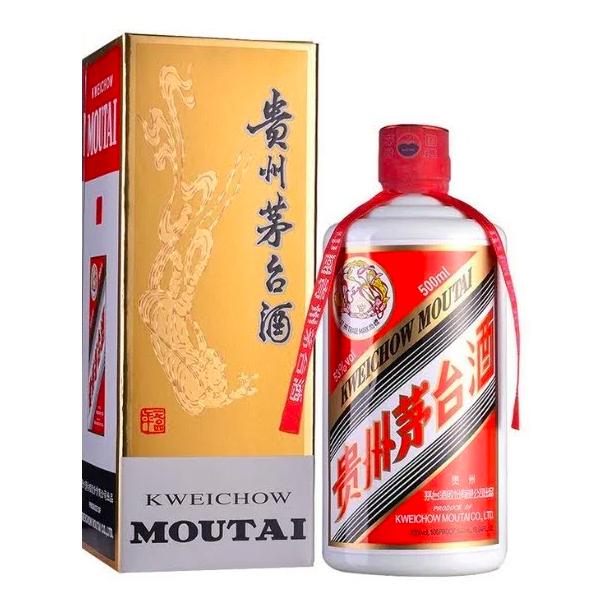
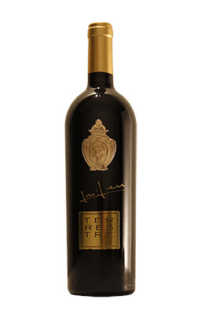
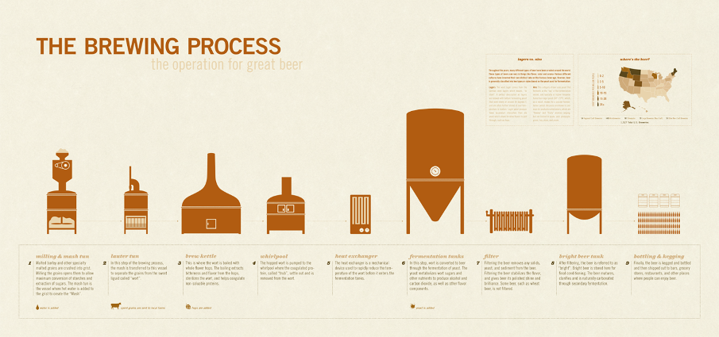
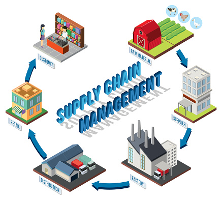
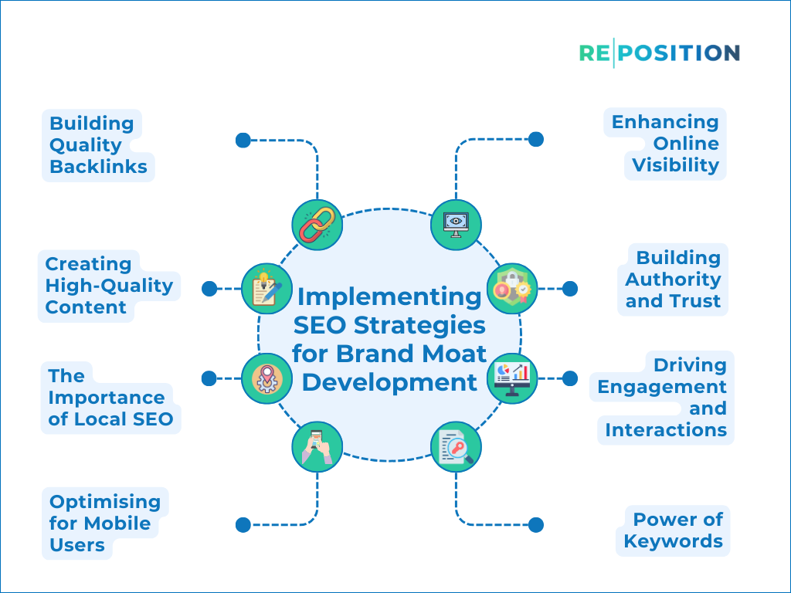
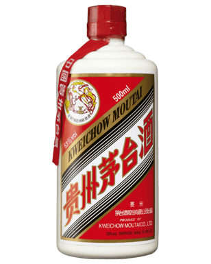

# 茅台和宁德时代的战略区别

## 引言

# 引言

在中国乃至全球的经济舞台上，茅台与宁德时代是两个极具影响力的公司，分别在各自的行业中占据了领导地位。茅台，作为中国白酒行业的标杆，不仅在国内市场享有极高的声誉，其品牌价值和产品品质也赢得了国际市场的广泛认可。宁德时代则是全球领先的新能源汽车电池供应商，凭借其技术创新和市场拓展能力，迅速崛起成为行业内的佼佼者。这两家公司在战略上的不同选择，不仅反映了各自行业的特点和发展趋势，也为研究企业战略选择提供了宝贵的案例。

## 行业背景

茅台，全称贵州茅台酒股份有限公司，成立于1951年，主要生产和销售茅台酒及其他酱香型白酒。茅台酒以其独特的酿造工艺和卓越的品质，被誉为“国酒”，是中国传统文化的重要符号之一。在国内外市场，茅台酒不仅是一种商品，更是一种文化和身份的象征。茅台的成功，不仅在于其深厚的文化底蕴和品牌价值，还在于其精细的市场运营和品牌维护策略。

宁德时代新能源科技股份有限公司，成立于2011年，专注于新能源汽车动力电池系统、储能系统的研发、生产和销售。随着全球对环境保护和可持续发展的重视，新能源汽车行业迎来了前所未有的发展机遇。宁德时代凭借其在电池技术上的持续创新和大规模的生产能力，迅速成为全球最大的动力电池供应商之一。其产品广泛应用于乘用车、商用车、储能系统等多个领域，为推动全球新能源汽车产业的发展做出了重要贡献。

## 战略比较的重要性

茅台与宁德时代虽然分属不同行业，但它们在各自领域内的成功，都离不开明确的战略定位和有效的执行。茅台的战略重点在于维护和提升品牌价值，通过严格的品质控制和文化营销，巩固其在中国乃至全球高端白酒市场的领先地位。而宁德时代则更侧重于技术创新和市场拓展，通过不断研发高性能电池技术和全球化的市场布局，逐步确立其在全球新能源汽车电池行业的领导地位。

通过对比茅台和宁德时代的战略选择，我们可以更深入地理解不同行业背景下企业的战略制定和执行方式。这种比较不仅有助于企业自身战略的优化和调整，也为研究者提供了丰富的案例资料，有助于深化对企业战略管理理论的理解和应用。在接下来的章节中，我们将详细探讨这两家公司在战略上的具体差异及其背后的逻辑，以期为读者提供更加全面和深入的分析。

---

## 企业背景与行业定位

### 企业背景与行业定位

在当今快速变化的商业环境中，企业的战略选择往往决定了其未来的走向。茅台和宁德时代，分别作为传统白酒行业和新能源电池领域的领军企业，它们的核心业务差异明显，战略定位也各有侧重。

#### 茅台：传统白酒行业的龙头

贵州茅台酒股份有限公司（简称“茅台”）成立于1951年，总部位于中国贵州省遵义市。茅台酒是中国白酒的代表之一，以其独特的酱香型风味和悠久的历史文化而闻名于世。作为一家传统的酿酒企业，茅台的核心业务是生产和销售高端白酒，其产品不仅在国内市场占据主导地位，也在国际市场上享有盛誉。

茅台的成功在很大程度上得益于其深厚的品牌积淀和卓越的产品质量。茅台酒的酿造工艺复杂，需要经过长时间的发酵和陈酿，确保每一瓶酒都能达到极高的品质标准。此外，茅台还通过严格的渠道管理和市场推广，保持了其高端品牌形象，从而在竞争激烈的白酒市场中保持了领先地位。

#### 宁德时代：新能源电池的领军企业

宁德时代新能源科技股份有限公司（简称“宁德时代”）成立于2011年，总部位于中国福建省宁德市。宁德时代是全球领先的新能源电池供应商，专注于锂离子电池的研发、生产和销售。随着全球对可持续能源和电动汽车需求的不断增长，宁德时代迅速崛起，成为这一领域的领头羊。

宁德时代的核心业务是为电动汽车、储能系统和消费电子设备提供高性能的电池解决方案。公司拥有一支强大的研发团队，不断推动技术创新，提升电池的性能、安全性和成本效益。宁德时代与多家国际知名汽车制造商建立了战略合作关系，为其提供先进的电池技术和解决方案，这不仅巩固了其市场地位，也为全球新能源产业的发展做出了重要贡献。

#### 行业定位的差异

茅台和宁德时代虽然同为各自领域的龙头企业，但它们的行业定位和战略方向存在显著差异。茅台作为传统白酒行业的代表，其核心竞争力在于深厚的文化底蕴和卓越的产品品质。公司通过精心维护品牌形象和严格控制产品质量，确保在高端市场的持续领先地位。

相比之下，宁德时代则处于一个快速发展的新兴行业——新能源电池。公司注重技术创新和市场拓展，致力于为客户提供高性能、高安全性的电池解决方案。宁德时代的成功不仅取决于其技术优势，还在于其对市场趋势的敏锐洞察和快速反应能力。

### 总结

茅台和宁德时代虽然在行业背景和核心业务上存在明显差异，但它们都在各自的领域内取得了显著的成就。茅台凭借其深厚的文化积淀和卓越的产品质量，在传统白酒市场中稳居龙头地位；而宁德时代则通过持续的技术创新和市场拓展，成为全球新能源电池领域的领军企业。两者的发展路径和战略选择为其他企业提供了宝贵的经验和借鉴。

---

## 产品战略差异

### 产品战略差异

茅台和宁德时代作为各自领域的领军企业，其产品战略的差异显著，反映了两家公司在市场定位、产品开发和市场拓展上的不同思路。茅台以高端白酒市场为基点，通过维护产品的稀缺性和高价值，构建了独特的品牌和市场地位。而宁德时代则专注于新能源汽车电池的技术创新和规模化生产，通过不断的技术迭代和成本优化，成为全球领先的电池供应商。

#### 茅台的高端稀缺性策略

茅台酒以其独特的酿造工艺和历史文化积淀，长期以来在消费者心中树立了高端、稀缺的品牌形象。茅台通过严格控制产量，确保每一瓶茅台酒都具有较高的品质和收藏价值。这种稀缺性策略不仅提升了茅台酒的市场价格，也增强了品牌的吸引力和市场竞争力。茅台还通过严格的品牌管理，防止市场上的假冒伪劣产品，进一步巩固了其高端市场的地位。

#### 宁德时代的技术迭代与规模化生产

相比之下，宁德时代则采取了完全不同的产品战略。作为全球领先的新能源汽车电池供应商，宁德时代的核心竞争力在于其强大的研发能力和高效的生产体系。公司不断投入资源进行技术研发，推动电池技术的迭代升级，以满足市场对更高性能、更低成本电池的需求。同时，宁德时代通过规模化生产，实现了成本的有效控制，使其产品在价格上具有竞争力，从而在国内外市场上占据了重要份额。

#### 战略差异的背后

茅台和宁德时代的战略差异，根本上反映了两家企业所处行业的特点和市场需求的不同。茅台所在的高端白酒市场，消费者更加注重产品的品质、品牌历史和文化价值，因此茅台通过稀缺性和高端定位来满足这一需求。而宁德时代所处的新能源汽车行业，技术进步和成本控制是企业生存和发展的关键，因此宁德时代通过不断的技术创新和规模化生产，满足了市场对高性能、低成本电池的需求。

#### 结论

综上所述，茅台和宁德时代在产品战略上的显著差异，既体现了两家企业的市场定位和竞争策略，也反映了不同行业的发展特点和消费者需求的变化。茅台通过高端稀缺性策略，成功维护了其品牌和市场地位；而宁德时代则通过技术迭代和规模化生产，实现了市场的快速拓展和技术领先。这两种不同的战略模式，为其他企业在各自的领域内提供了有益的借鉴和启示。

---

## 市场扩张路径

## 市场扩张路径

### 茅台的品牌文化输出与全球化缓慢推进

茅台作为中国白酒行业的领军品牌，其市场扩张策略在很大程度上依赖于其深厚的品牌文化和独特的地域优势。茅台酒不仅是一种饮品，更是一种文化的象征，代表着中国的传统工艺和文化传承。因此，茅台在市场扩张上采取了较为保守和稳健的策略，尤其是对于国际市场的开发。

茅台的国际扩张路径主要集中在品牌文化的输出上，通过参与国际展会、高端品鉴会等活动，逐步提升其国际知名度和影响力。此外，茅台还通过在海外设立专卖店和代理渠道，逐步渗透到国际市场。然而，这一过程相对缓慢，茅台更注重每一步的质量而非速度，确保其品牌形象和产品品质在国际市场上得到良好的维护 [来源：茅台官网](https://www.moutaichina.com/)

### 宁德时代的产业链整合与快速国际布局

与茅台不同，宁德时代作为全球领先的新能源汽车动力电池制造商，其市场扩张策略更为激进和迅速。宁德时代通过不断的技术创新和产业链整合，迅速在全球范围内建立起强大的市场地位。

宁德时代的国际扩张路径主要体现在以下几个方面：

1. **技术领先**：宁德时代持续投入研发，保持其在电池技术领域的领先地位，这是其快速扩张的基础。
2. **战略合作**：宁德时代与多家国际知名汽车制造商建立了战略合作关系，如特斯拉、宝马等，这不仅为其带来了稳定的订单，也加速了其技术的国际化进程。
3. **海外布局**：宁德时代在多个国家和地区建立了生产基地和研发中心，如德国、法国、日本等，这有助于其更好地服务全球客户，同时规避贸易风险 [来源：宁德时代官网](https://www.catl.com/)

### 结论

茅台和宁德时代在市场扩张路径上的差异，反映了两家公司在行业特性、企业文化和战略定位上的不同。茅台注重品牌文化的传承和国际市场的稳健推进，而宁德时代则通过技术创新和产业链整合，实现了快速的国际布局。这两种不同的策略，都在各自的领域内取得了显著的成果，为其他企业提供了宝贵的经验和启示。

---

## 研发与技术投入

### 研发与技术投入

在探讨茅台与宁德时代的战略区别时，研发与技术投入是两家企业显著不同的一个方面。茅台作为中国白酒行业的领军者，其成功在很大程度上归功于传统工艺的传承与保护。而宁德时代作为新能源电池领域的先驱，其迅速崛起则依赖于高强度的研发投入和强大的专利壁垒构建。

#### 茅台的传统工艺传承

茅台酒的生产过程严格遵循传统的酿造工艺，这一工艺经过数百年的传承和优化，已成为茅台品牌的核心竞争力。茅台公司非常重视对传统工艺的保护和传承，认为这是确保其产品独特品质的关键。公司的研发投入主要集中在工艺的微调、质量控制和生产效率的提升上，而不是寻求彻底的技术革新。这种策略帮助茅台在保持产品品质的同时，也维护了其作为高端白酒品牌的市场地位。

#### 宁德时代的高强度研发投入

与茅台专注于传统工艺不同，宁德时代自成立以来就非常重视技术创新和研发。作为全球领先的新能源电池制造商，宁德时代深知在快速变化的新能源领域，持续的技术创新是保持竞争力的关键。因此，公司每年都会投入大量的资金用于研发，这些资金不仅用于新电池技术的开发，还包括生产工艺的改进、材料科学的研究以及产品的安全性测试等方面。

宁德时代在研发上的投入不仅体现在资金上，还包括对人才的吸引和培养。公司建立了多个研发中心，与国内外多所知名高校和研究机构建立了合作关系，形成了一个强大的研发网络。通过这种持续的高强度研发投入，宁德时代已经积累了大量的专利技术，构建了坚固的专利壁垒，这不仅保护了公司的技术创新成果，也为其在全球市场上的竞争提供了有力的支持。

#### 结论

茅台和宁德时代在研发与技术投入上的战略选择反映了各自行业特点和市场定位的不同。茅台通过保护和传承传统工艺，确保了产品的独特性和高端形象；而宁德时代则通过高强度的研发投入，不断推动技术进步，构建了坚实的专利壁垒，为公司的长远发展奠定了基础。这两种不同的策略，共同展现了中国企业在各自领域内的独特竞争力和发展路径。

---

## 供应链管理

### 供应链管理

在探讨茅台与宁德时代在供应链管理上的战略区别时，两者的行业特性和产品特性决定了它们在原材料获取、供应链结构以及可持续发展方面的不同策略。茅台作为一家以传统酿造工艺著称的白酒企业，其供应链管理高度依赖于特定地区的原材料，而宁德时代作为全球领先的新能源电池制造商，其供应链则更注重全球资源的锁定与循环回收体系的建立。

#### 茅台的地域依赖性

茅台酒的酿造工艺对原材料的品质有着极其严格的要求，尤其是高粱和小麦，这些原材料的质量直接影响到最终产品的口感和品质。茅台所用的高粱和小麦主要来源于茅台镇及其周边地区，这些地区的自然环境和土壤条件被认为是最适合这些作物生长的。因此，茅台的供应链管理在很大程度上依赖于对这些特定地区原材料的稳定供应。为了确保原材料的质量和供应稳定性，茅台与当地农民建立了长期的合作关系，通过提供技术支持和收购保证，确保原材料的品质和供应量 [来源：茅台官方网站]。

#### 宁德时代的全球资源锁定与循环回收

与茅台的地域依赖性不同，宁德时代作为一家全球化的高科技企业，其供应链管理更注重全球资源的获取和循环利用。锂、钴、镍等关键电池材料在全球分布广泛，但资源集中度高，价格波动大。宁德时代通过与全球多个矿产资源供应商建立合作关系，确保了原材料的稳定供应。此外，宁德时代还积极布局电池回收业务，通过回收废旧电池中的有价值的金属材料，不仅降低了生产成本，还减少了对原生资源的依赖，实现了资源的循环利用 [来源：宁德时代官方网站]。

#### 结论

茅台和宁德时代在供应链管理上的战略区别，反映了各自行业特性和产品需求的不同。茅台的供应链管理重点在于确保特定地区原材料的品质和供应稳定性，而宁德时代则通过全球资源的锁定和循环回收体系，实现了供应链的高效、稳定和可持续发展。这两种不同的供应链管理模式，正是两家企业在各自领域成功的关键因素之一。

---

## 风险应对逻辑

### 风险应对逻辑

在现代企业的战略规划中，风险应对是不可或缺的一环。茅台和宁德时代作为各自领域的领军企业，面对的风险类型及其应对策略各有不同。茅台主要应对的是政策风险，而宁德时代则需应对技术颠覆的风险。

#### 茅台：政策风险与品牌护城河

茅台作为中国白酒行业的龙头企业，其品牌价值和市场地位得到了广泛认可。然而，作为一家高度依赖政策环境的企业，茅台面临着政策风险的挑战。这些风险包括政府对白酒行业的税收政策调整、对公款消费的限制以及对酒类广告的管控等。

为了应对这些政策风险，茅台建立了强大的品牌护城河。品牌护城河不仅体现在茅台酒的独特品质和历史悠久的品牌故事上，还体现在其深厚的文化底蕴和广泛的消费者基础。茅台通过不断强化品牌认知和品牌忠诚度，确保即使在政策环境变化时，也能保持稳定的市场需求。此外，茅台还通过多元化的产品线和市场策略，减少对单一市场的依赖，进一步增强其抗风险能力。

#### 宁德时代：技术颠覆与生态链布局

与茅台不同，宁德时代作为全球领先的动力电池解决方案提供商，面临的主要风险来自于技术的快速迭代和市场竞争的激烈。新能源汽车行业的发展日新月异，技术进步的速度决定了企业的生存和发展。因此，宁德时代必须不断投入研发，保持技术领先。

为了应对技术颠覆的风险，宁德时代采取了生态系统布局的战略。这包括与上下游企业的紧密合作，如与汽车制造商共建电池生产基地，以及与材料供应商共同研发新型电池材料。通过构建一个涵盖研发、生产、销售和回收的完整生态链，宁德时代不仅能够快速响应市场变化，还能在技术迭代中保持竞争力。此外，宁德时代还积极拓展国际市场，通过全球布局降低单一市场的风险，确保企业持续稳定发展。

### 结论

茅台和宁德时代在风险应对策略上的不同，反映了两家企业所处行业的特点和面临的挑战。茅台通过构建强大的品牌护城河来应对政策风险，而宁德时代则通过生态链布局来应对技术颠覆的风险。这些策略不仅体现了企业的智慧，也为其他企业在风险管理上提供了有益的借鉴。

---

## 未来战略方向

### 未来战略方向

在快速变化的市场环境中，企业需要不断调整和优化其战略方向，以保持竞争力。茅台和宁德时代作为各自领域的领军企业，其未来战略方向的差异反映了不同的市场定位和发展目标。

#### 茅台的非酒类业务探索

茅台，作为中国白酒行业的巨头，其核心业务一直聚焦于高端白酒的生产和销售。然而，面对日益激烈的市场竞争和消费趋势的变化，茅台开始积极探索非酒类业务，以寻找新的增长点。2022年，茅台正式上线了“i茅台”APP，这一平台不仅销售茅台酒，还推出了多种非酒类产品，如茅台冰激凌等 [来源](https0://www.chinanews.com.cn/cj/2022/06-29/9783447.shtml)。此举旨在通过多元化产品线，吸引更广泛的消费者群体，特别是年轻消费者。

此外，茅台还涉足了金融领域，成立了茅台财务公司，提供金融服务和资金管理，进一步增强其在资本市场的影响力。茅台的战略调整不仅是为了应对短期的市场波动，更是为了构建一个更加多元和稳定的业务生态系统。

#### 宁德时代的储能、换电等新增长点布局

宁德时代作为全球领先的动力电池供应商，其战略方向更加聚焦于新能源产业的前沿技术。随着全球对可再生能源需求的增加，宁德时代在储能和换电业务上进行了大力布局。2021年，宁德时代宣布将投资390亿元人民币，用于建设储能电池生产基地，进一步巩固其在全球储能市场的领先地位 [来源](https0://www.sohu.com/a/481450523_120086710)。

在换电业务方面，宁德时代与多家汽车厂商合作，推出了换电解决方案，旨在解决电动汽车充电时间长、续航里程短等问题。换电模式不仅提升了用户体验，还为宁德时代带来了新的商业模式和收入来源。2022年，宁德时代与蔚来汽车合作，推出了“车电分离”模式，用户可以按需选择电池的租赁和更换服务，进一步推动了电动汽车的普及 [来源](https0://www.chinanews.com.cn/cj/2022/03-01/9691271.shtml)。

#### 结论

茅台和宁德时代的未来战略方向反映了各自在不同行业中的独特定位。茅台通过非酒类业务的探索，旨在拓宽市场和吸引年轻消费者，构建多元化的业务生态系统。而宁德时代则通过储能和换电业务的布局，继续领先于新能源产业的发展，推动全球能源转型。两家企业在战略上的差异，不仅体现了各自的核心竞争力，也为其他企业在未来市场中提供了宝贵的借鉴。

---

## 结论

## 结论

在探讨茅台和宁德时代的战略区别时，我们不仅看到了两家公司在各自领域的成功，更深刻地认识到了传统行业与新兴产业在战略选择上的显著差异及其背后的逻辑。通过对比分析，我们可以总结出以下几点启示，这对其他企业制定战略具有重要的参考价值。

### 传统行业的品牌与文化传承

茅台作为中国传统白酒行业的代表，其成功在很大程度上归功于深厚的品牌历史和文化传承。茅台不仅仅是一种商品，更是一种文化和情感的载体。茅台通过持续的品牌建设，强化了其在中国乃至全球消费者心中的独特地位。对于传统行业而言，品牌和文化的积淀是企业长期发展的基石，是与消费者建立深厚情感连接的重要途径。

### 新兴产业的技术创新与市场适应

与茅台不同，宁德时代作为新能源汽车电池领域的领军企业，其成功更多地依赖于技术创新和市场适应能力。宁德时代通过不断的技术研发，推动了电池能量密度的提升和成本的降低，为新能源汽车的普及提供了关键技术支持。同时，宁德时代能够快速响应市场变化，与全球多家知名汽车制造商建立合作关系，确保了其在市场上的领先地位。这一模式为新兴产业提供了宝贵的借鉴，即持续的技术创新和灵活的市场策略是赢得竞争的关键。

### 战略选择的差异性

茅台和宁德时代的战略差异，反映了传统行业与新兴产业在市场环境、消费者需求和技术发展等方面的本质区别。传统行业更加注重品牌和文化的长期建设，而新兴产业则更加强调技术创新和市场适应能力。这种差异性不仅体现在具体的战略措施上，更体现在企业文化和价值观的塑造上。

### 未来的启示

面对不断变化的市场环境，无论是传统行业还是新兴产业，都需要灵活调整战略，以适应新的挑战和机遇。传统行业可以通过技术创新提升产品品质，拓展新的市场空间；新兴产业则可以通过品牌建设和文化塑造，增强消费者的品牌忠诚度。未来，两种模式的融合将为企业带来更多的可能性。

总之，茅台和宁德时代的战略差异为不同类型的行业提供了宝贵的启示。通过学习和借鉴这些成功企业的经验，其他企业可以更好地制定适合自身发展的战略，实现可持续增长。

---

