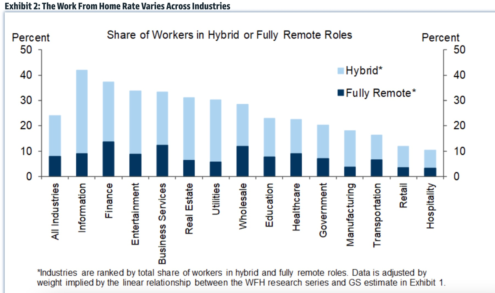
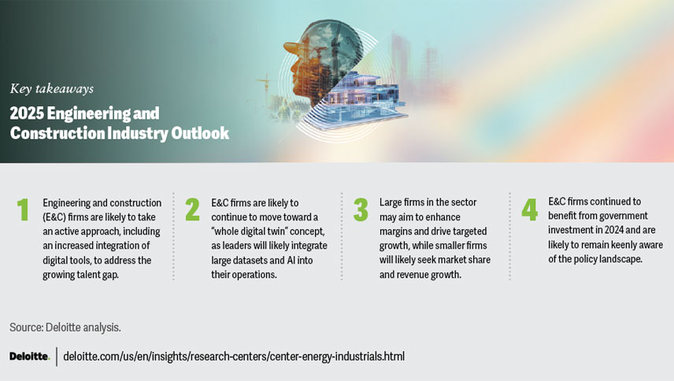
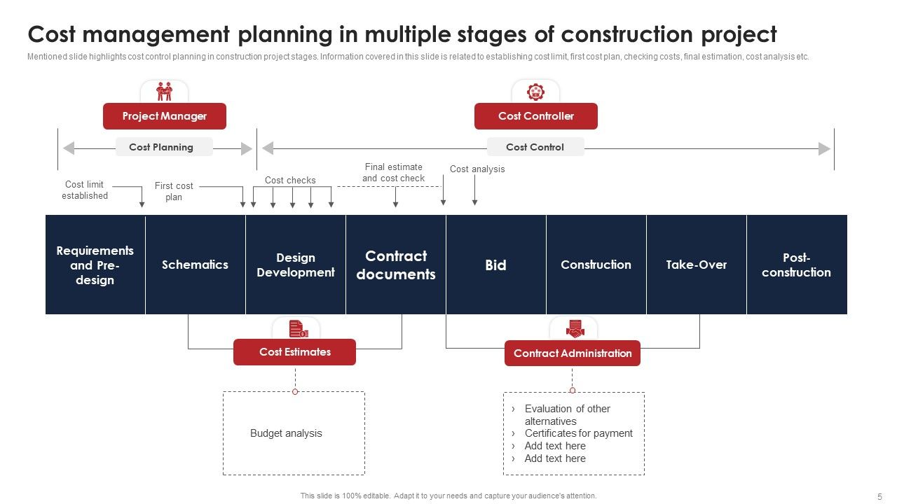
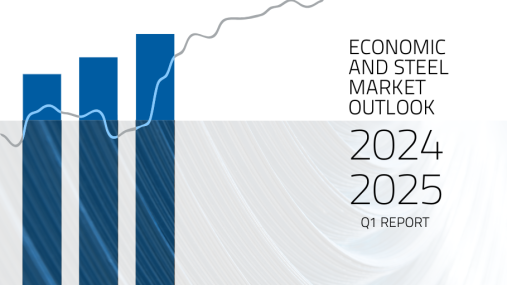

# 2025年工程造价的行业前景

## 引言：工程造价行业的现状与2025年展望

### 引言：工程造价行业的现状与2025年展望

工程造价行业作为建筑产业链中不可或缺的一环，其发展直接影响到建筑项目的成本控制、进度管理和质量保障。当前，该行业正经历着从传统模式向现代化、智能化转型的关键时期。本文将概述工程造价行业的现状，探讨其未来五年的核心发展趋势，并分析推动行业转型的关键驱动力。

#### 当前行业现状

当前，工程造价行业面临着一系列挑战与机遇。一方面，随着建筑项目复杂度的提升，传统的手工计算和经验判断已难以满足精确化、高效化的管理需求；另一方面，技术的革新为行业带来了前所未有的变革机遇，如BIM（Building Information Modeling，建筑信息模型）技术、大数据分析、人工智能等，这些技术的应用不仅提高了项目管理的透明度和效率，也为成本控制提供了更加科学的依据。

#### 2025年行业展望

展望2025年，工程造价行业将呈现以下几个显著的发展趋势：

1. **数字化转型加速**：随着云计算、大数据、人工智能等信息技术的深度融合，工程造价行业将实现从信息收集、数据分析到决策支持的全流程数字化。例如，AI技术可以自动识别设计图纸中的错误和不一致，大大减少人为错误，提高项目预算的准确性。此外，通过大数据分析，企业能够更精准地预测项目成本，优化资源配置，提升项目整体效益。

2. **政策引导与支持**：政府对建筑行业的政策支持将继续加强，特别是在推动绿色建筑、智能建筑发展方面。政策的调整将为工程造价行业带来新的增长点，如鼓励采用节能环保材料和施工技术，推动建筑行业的可持续发展。同时，政府也将加大对数字化转型的支持力度，出台相关政策和标准，促进技术的广泛应用。

3. **专业人才的需求增加**：随着行业技术的不断进步，对具备跨学科知识背景的专业人才需求将显著增加。未来，工程造价行业不仅需要掌握传统工程管理知识的专业人士，更需要能够熟练运用新技术、新方法解决实际问题的复合型人才。企业和教育机构将加强合作，共同培养适应行业发展需求的高素质人才。

综上所述，工程造价行业正处于重要的转型期，数字化、政策调整等将成为推动行业发展的关键因素。未来五年，行业将通过技术创新和人才培养，不断优化服务模式，提升行业整体竞争力，为建筑行业的高质量发展贡献力量。

---

## 技术驱动的行业变革

### 技术驱动的行业变革

在21世纪的第二个十年接近尾声时，工程造价行业正经历着前所未有的技术革命。BIM（Building Information Modeling）、AI（Artificial Intelligence）与大数据技术的融合，不仅显著提升了项目的效率和精准度，还预示着2025年技术应用将更加深入和广泛。

#### BIM：构建信息的中枢

BIM技术通过创建和使用数字化模型，实现了从设计到施工再到运营的全流程管理。这一过程不仅减少了传统的设计与施工间的误解和错误，还大幅提高了项目的透明度和协作效率。BIM的应用使得工程造价师能够更准确地预估成本，通过模拟不同的设计方案和施工方案，选择最优解。预计到2025年，BIM将成为工程造价项目管理的标准工具，其应用范围将从大型项目扩展到中小型项目，从单一建筑扩展到整个城市规划。

#### AI：智能化的决策支持

AI技术的发展为工程造价行业带来了智能化的决策支持。通过机器学习算法，AI能够分析大量的历史项目数据，识别成本超支的主要原因，预测未来项目的风险点。此外，AI还能够通过自然语言处理技术，自动分析和处理合同文件，减少人工审核的工作量，提高合同管理的效率。预计到2025年，AI将在工程造价的预算编制、成本控制和风险评估中发挥关键作用，成为项目管理者不可或缺的助手。

#### 大数据：洞察未来的工具

大数据技术的应用为工程造价行业提供了前所未有的数据处理能力。通过收集和分析项目周期中的大量数据，大数据技术能够揭示隐藏的趋势和模式，帮助造价师做出更加科学的决策。例如，通过分析不同地区的材料价格波动，可以更准确地预测未来成本走势；通过分析施工过程中的安全数据，可以提前采取措施预防事故。预计到2025年，大数据将不仅仅是数据的收集和处理，而是转变为一种洞察未来、优化决策的重要工具。

#### 结论

技术的不断进步正在重塑工程造价行业的面貌。BIM、AI与大数据等技术的应用，不仅提高了项目的效率和精准度，还为行业的未来发展开辟了新的路径。到2025年，这些技术的应用将更加成熟和普遍，进一步推动工程造价行业的转型升级，使其更加智能化、高效化和可持续化。

---

## 政策与市场环境的影响

### 政策与市场环境的影响

在探讨2025年工程造价行业的前景时，政策与市场环境的影响是不可忽视的关键因素。这一章节将重点分析绿色建筑、碳中和目标等政策要求如何重塑工程造价标准，以及新兴市场，如“一带一路”倡议带来的机遇。

#### 绿色建筑与碳中和目标

随着全球对环境保护意识的增强，绿色建筑和碳中和成为各国政府和行业的共同目标。在中国，政府已出台多项政策，鼓励和支持绿色建筑的发展，如《绿色建筑创建行动方案》和《建筑节能与绿色建筑发展“十四五”规划》。这些政策不仅要求新建建筑达到绿色建筑标准，还鼓励既有建筑进行绿色改造，以减少能源消耗和碳排放。

这些政策的实施对工程造价行业产生了深远影响。首先，绿色建筑标准的提高意味着项目成本的增加。例如，使用环保材料、安装高效能的暖通空调系统和智能控制系统等，都需要额外的投入。然而，从长远来看，这些投资将通过降低运营成本和提高建筑的市场竞争力而得到回报。因此，工程造价师需要在项目初期就充分考虑这些因素，进行全生命周期的成本效益分析。

#### 新兴市场的机遇

在国际市场上，“一带一路”倡议为中国企业提供了广阔的机遇。这一倡议旨在促进沿线国家的基础设施建设，涵盖交通、能源、通讯等多个领域。对于工程造价行业而言，这意味着大量的项目机会和市场潜力。

然而，参与“一带一路”项目的中国企业也面临着诸多挑战，如复杂的政策环境、不同的工程标准和文化差异等。为了成功抓住这些机遇，企业需要加强与当地政府和企业的合作，深入了解当地的市场环境和法规要求，同时提升自身的项目管理和技术能力。

#### 综合分析

综上所述，2025年工程造价行业的前景受到政策与市场环境的双重影响。绿色建筑和碳中和政策不仅提高了项目成本，也推动了行业向更加可持续和高效的方向发展。与此同时，“一带一路”倡议为工程造价企业带来了新的市场机遇，但同时也要求企业具备更强的国际竞争力和适应能力。

在这一背景下，工程造价师需要不断学习和适应新的政策和技术，提升自身的专业水平，以应对未来的挑战和机遇。

---

## 人才需求与职业能力升级

## 人才需求与职业能力升级

随着2025年的逐渐临近，工程造价行业正面临着前所未有的变革。这一变化不仅体现在技术的应用上，更体现在对人才的需求上。未来的工程造价行业将更加重视复合型人才的培养，尤其是那些能够熟练应用数字化工具、具备可持续工程知识的专业人士。

### 数字化工具应用

在未来的工程造价领域中，数字化工具的应用将成为不可或缺的一部分。随着BIM（建筑信息模型）技术的普及，工程师们不仅需要掌握传统的工程造价技能，还需要能够熟练使用BIM软件进行项目的成本估算、进度管理和质量控制。此外，随着人工智能和大数据技术的发展，利用这些技术进行成本预测、风险评估等高级分析也将成为工程造价人员的新挑战。这意味着未来的工程造价专业人员需要不断学习新技术，提升自身的数字技能，以适应行业的快速发展 [来源标题](#)。

### 可持续工程知识

随着全球对环境保护意识的增强，可持续发展已成为工程项目建设的重要考量因素之一。因此，工程造价人员在进行项目评估时，不仅要考虑成本和质量，还必须将环境影响纳入考量范围，确保项目的可持续性。这要求工程造价人员具备一定的环境科学知识，了解绿色建筑材料的选择、能源效率的提升以及废弃物管理等方面的专业知识。通过掌握这些知识，工程造价人员可以为客户提供更加全面和负责任的咨询服务，帮助企业在满足经济效益的同时，实现环境效益的最大化 [来源标题](#)。

### 职业能力升级的必要性

面对上述变化，工程造价行业的人才必须进行职业能力的升级。这不仅是个人职业发展的需要，更是行业发展的必然趋势。对于个人而言，通过不断学习和实践，掌握最新的技术和知识，可以提升自身的竞争力，获得更好的职业发展机会。对于企业而言，拥有具备先进技能的团队，可以提高项目的执行效率，降低成本，增强市场竞争力。因此，无论是个人还是企业，都应该积极适应这一变化，通过培训和教育，不断提升自身的专业能力，以迎接2025年工程造价行业的全新挑战。

综上所述，2025年的工程造价行业将更加注重人才的综合能力，尤其是数字化工具的应用和可持续工程的知识。这不仅是行业发展的必然趋势，也为广大从业者提供了广阔的职业发展空间。通过不断学习和适应，每一位工程造价领域的专业人士都能够在这一变革中找到属于自己的位置，实现个人与行业的共同成长。

---

## 挑战与风险

### 挑战与风险

随着2025年的临近，工程造价行业面临着前所未有的挑战和风险。这些挑战不仅来自于技术的快速发展，还涉及到数据安全、传统模式转型的阻力等方面。本章节将深入探讨这些潜在问题，并提出相应的应对思路。

#### 技术落地成本

技术的快速进步为工程造价行业带来了新的解决方案，如BIM（建筑信息模型）和AI（人工智能）的应用，极大地提高了项目的效率和准确性。然而，这些技术的引入和实施往往伴随着高昂的初期成本，包括软件购买、硬件升级和专业培训等。对于中小型企业和项目来说，这些成本可能成为阻碍技术采用的主要因素 [来源标题](#)。

**应对思路**：政府和行业协会可以提供政策支持和资金补贴，帮助中小企业减轻负担。同时，企业应考虑通过合作或租赁方式，减轻技术投资的压力。此外，通过逐步引入技术，逐步积累经验，可以有效降低风险。

#### 数据安全

随着数字化转型的深入，工程造价行业对数据的依赖程度越来越高。数据不仅包括项目成本、进度等基本信息，还涉及客户敏感信息和商业秘密。数据泄露不仅会造成经济损失，还可能损害企业的声誉。如何保护这些数据的安全，成为了行业必须面对的重要问题。

**应对思路**：企业应加强数据安全意识，建立完善的数据安全管理体系。这包括使用加密技术保护数据传输和存储，定期进行安全审计，以及培训员工提高安全意识。同时，企业还应与专业的网络安全服务商合作，确保技术防护措施的及时更新和有效实施。

#### 传统模式转型阻力

尽管新技术带来了诸多优势，但传统模式的根深蒂固和转型的复杂性也是不可忽视的挑战。许多企业在长期运营中形成了固定的工作流程和管理方式，员工对于新技术的接受程度不一，尤其是中老年员工，可能对新技术的学习和适应感到困难。此外，转型过程中的不确定性也使得企业决策层在推进改革时犹豫不决。

**应对思路**：企业应采取渐进式转型策略，逐步引入新技术和新流程，减少对现有工作的冲击。同时，加强员工培训和沟通，提高员工对新技术的接受度和使用能力。管理层应明确转型目标，制定详细的实施计划，并提供必要的支持和激励措施，确保转型过程的顺利进行。

综上所述，2025年工程造价行业在面对技术落地成本、数据安全和传统模式转型阻力等挑战时，需要通过多方面的努力和综合措施，逐步克服这些障碍，实现行业的可持续发展。

---

## 案例前瞻：2025年典型项目模式

### 案例前瞻：2025年典型项目模式

随着技术的不断进步和政策的积极引导，工程造价行业正迎来一系列变革。本章旨在通过模拟2025年的典型项目模式，展示未来工程造价管理如何在技术趋势和政策背景的双重驱动下，实现智能化协作与全生命周期成本管理。

#### 技术趋势的推动

2025年的工程造价行业，预计将广泛采用数字化和智能化技术，如BIM（建筑信息模型）、AI（人工智能）和大数据分析等。这些技术的应用将极大提升项目的精准度和效率，减少人为错误，提高项目各阶段的透明度和可追溯性。

- **BIM技术的应用**：通过BIM技术，项目从设计到施工再到维护的每个阶段都可以在虚拟环境中进行模拟和优化。这不仅有助于提前发现潜在问题，减少变更，还能通过实时数据交换，实现各参与方的高效协作。

- **AI与大数据的结合**：人工智能和大数据技术将被用于成本预测、风险评估和项目管理。通过分析历史数据，AI可以预测项目的潜在成本超支点，为决策者提供基于数据的建议，帮助项目团队做出更明智的决策。

#### 政策背景的支持

政府对建筑业的数字化转型给予了大力支持，通过出台相关政策和标准，鼓励技术创新和应用。例如，政府可能会推出激励措施，如税收减免或资金支持，以促进新技术的采用。此外，政府还可能通过立法，如制定数据共享和隐私保护的相关法律，为行业的健康发展提供法律保障。

#### 实战案例：智能成本管理平台

假设2025年，一家中型建筑公司正在建设一个大型商业综合体。该项目采用了先进的智能成本管理平台，该平台集成了BIM、AI和大数据技术。项目初期，通过BIM技术，设计团队与工程造价师合作，利用虚拟模型对设计方案进行成本优化。施工过程中，平台实时收集成本数据，AI系统自动分析成本偏差，及时向项目管理者发出预警，并提供调整建议。项目完成后，平台还能够生成详细的成本分析报告，帮助公司总结经验，为未来项目提供参考。

#### 结论

2025年的工程造价行业，将在技术进步和政策支持的双重作用下，实现从传统模式向智能化协作的转变。通过采用BIM、AI和大数据等技术，项目团队能够更高效地管理成本，提高项目的成功率。未来，随着技术的进一步成熟和应用的普及，工程造价行业将迎来更加广阔的发展前景。

---

## 结论：从被动核算到主动价值创造

### 结论：从被动核算到主动价值创造

随着2025年的临近，工程造价行业正经历着前所未有的转型。从传统的成本控制角色向更加战略性的决策支持者转变，这一过程不仅反映了技术进步的推动，也体现了市场对更高效率和更高质量服务的迫切需求。本章将总结这一转型的路径，并呼吁从业者积极布局，以适应未来的挑战和机遇。

#### 一、技术驱动的转型

技术的进步是推动工程造价行业变革的主要动力之一。BIM（建筑信息模型）、AI（人工智能）、大数据分析等技术的应用，使得工程造价从传统的手工计算和纸质记录，转变为更加自动化和智能化的流程。BIM技术的广泛应用，不仅提高了项目成本的精确度，还增强了项目的可视化和协同能力，为决策者提供了更加全面的数据支持。AI和大数据分析则进一步提升了成本预测的准确性，帮助企业在项目早期识别潜在的风险和机会，从而做出更加科学的决策。

#### 二、从成本控制到价值创造

随着技术的发展，工程造价的角色也在悄然发生变化。过去，工程造价师的主要职责是确保项目成本不超预算，减少不必要的开支。然而，随着企业对项目价值创造的重视，工程造价的角色逐渐从被动的成本控制转向主动的价值创造。通过深入分析项目成本结构，识别和优化成本驱动因素，工程造价师可以帮助企业实现成本优化的同时，提升项目的整体价值。例如，通过对建筑材料的性能和成本进行综合分析，选择性价比更高的材料，不仅降低了项目成本，还提高了项目的可持续性和市场竞争力。

#### 三、提前布局，迎接未来

面对行业转型，工程造价从业者需要提前布局，以适应未来的发展趋势。这不仅包括技术技能的提升，如熟练掌握BIM、AI等技术，还包括对行业知识的不断学习和更新。同时，建立跨学科的知识体系，如项目管理、财务管理等，将有助于从业者更好地理解项目全生命周期的成本和价值，从而在战略决策中发挥更大的作用。

总之，从被动的成本控制到主动的价值创造，工程造价行业的转型不仅是一次技术的革新，更是一次理念的飞跃。面对2025年的新机遇，从业者应积极拥抱变化，不断提升自身能力，为行业的可持续发展贡献力量。

---

