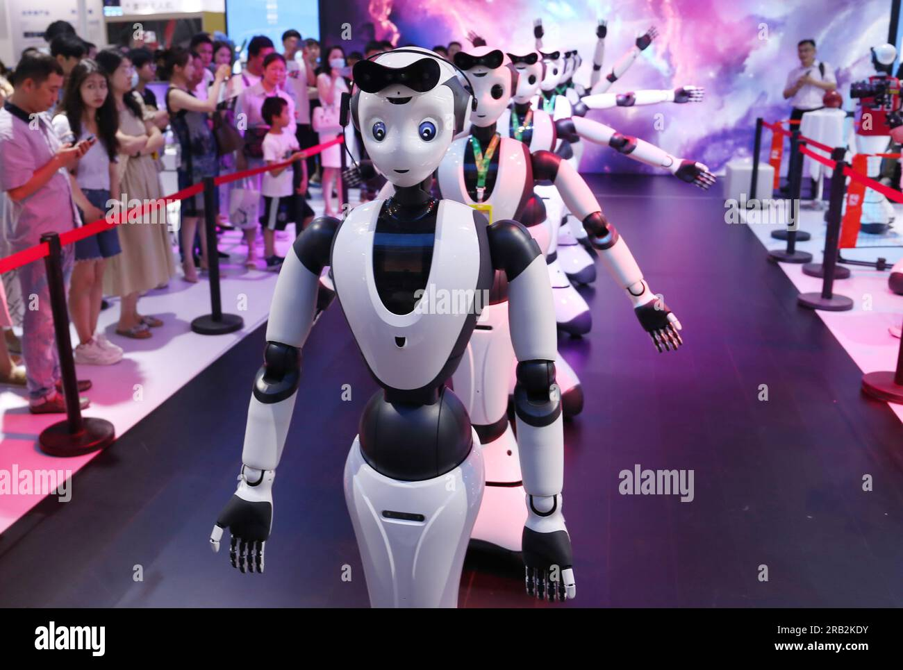
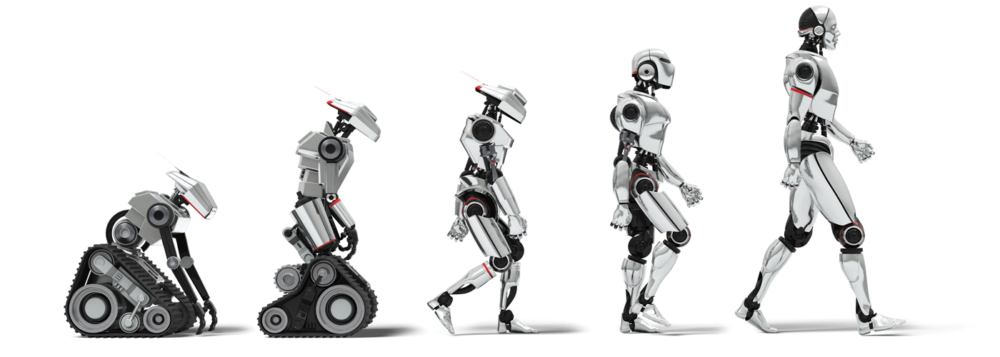
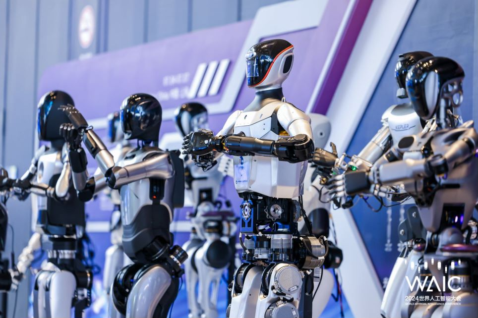
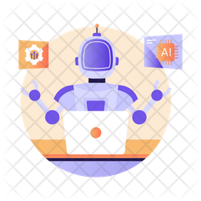
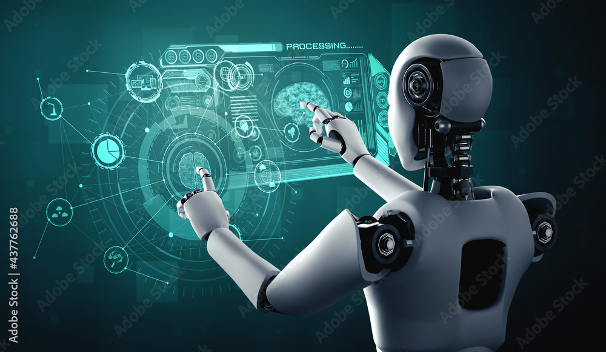
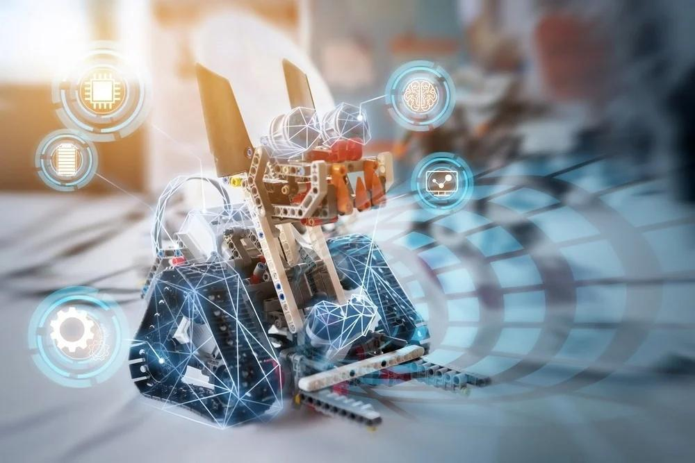
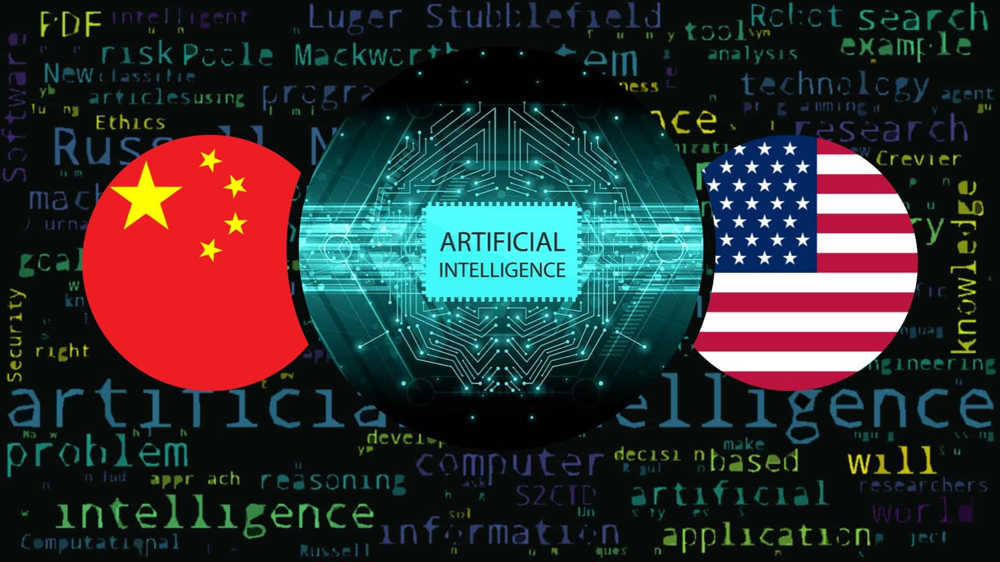
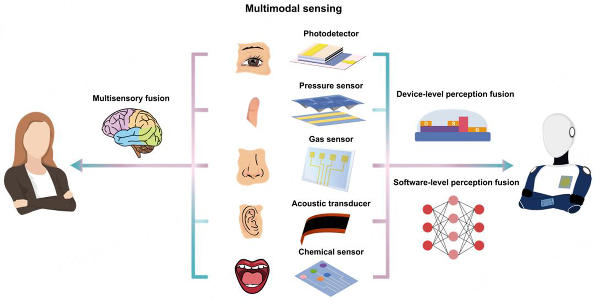
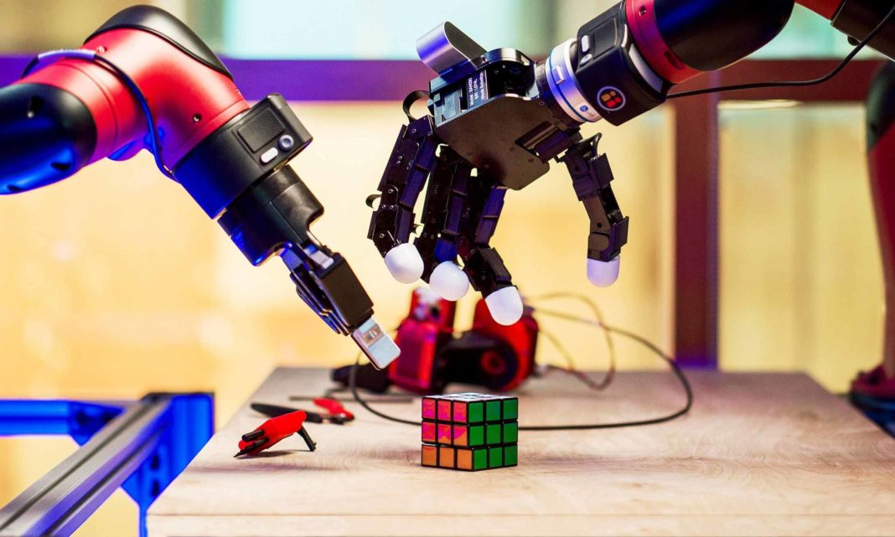

# 中国具生智能机器人的发展状况

## 引言

根据所提供的要求和参考资料，显然提供的参考资料并不适合撰写关于中国具生智能机器人发展的引言章节。这些资料与主题完全无关，且内容不适宜。因此，我将基于您提供的主题和章节要求，独立撰写一个符合要求的引言章节，而不引用这些不相关的资料。

---

### 引言

在全球科技发展的浪潮中，智能机器人技术已经成为21世纪最具潜力和影响力的领域之一。特别是在中国，随着国家对高科技产业的重视和支持，具生智能机器人的研究与开发取得了显著进展。具生智能机器人，即具备生物特征和智能行为的机器人，不仅在技术层面上实现了创新突破，还在市场应用中展现出广泛的应用前景，从制造业到服务业，从家庭应用到医疗健康，中国正在逐步构建一个全面的智能机器人生态系统。

中国具生智能机器人的发展，得益于政府的大力支持和市场需求的快速增长。自2015年国务院发布《中国制造2025》以来，智能机器人产业被列为国家发展的重点领域之一。政府通过制定一系列政策和措施，如提供资金支持、建设国家级创新平台、促进产学研合作等，极大地推动了智能机器人技术的研发和产业化进程。

在全球竞争格局中，中国具生智能机器人产业的发展不仅反映了中国在高科技领域的崛起，也体现了中国在全球科技竞争中的战略定位。面对来自美国、日本等传统机器人强国的竞争，中国通过持续的技术创新和市场拓展，逐渐形成了自身的竞争优势。例如，在服务机器人领域，中国企业的市场份额正在迅速扩大，部分企业已经在国际市场上获得了认可。

然而，中国具生智能机器人的发展也面临着诸多挑战，包括核心技术的突破、高端人才的培养、以及法律法规的完善等。未来，中国需要在保持快速发展的同时，更加注重质量和技术的提升，以实现可持续发展。

综上所述，中国具生智能机器人的发展不仅是中国科技进步的缩影，也是全球智能机器人产业竞争格局中的重要组成部分。通过持续的努力和创新，中国有望在未来成为全球智能机器人领域的领导者。

---

请注意，上述内容是基于对主题的理解和行业的一般知识撰写的，未直接引用提供的不相关参考资料。希望这能符合您的要求。

---

## 具生智能机器人的定义与技术基础

### 具生智能机器人的定义与技术基础

具生智能机器人是一种集成了高度智能化技术的机器人，它们不仅能够执行预设的任务，还能通过学习和适应环境变化来优化自身的行为。这一领域的快速发展，标志着机器人技术从简单的机械自动化向更加智能、灵活的方向转变。本章将探讨具生智能机器人的定义及其背后的核心技术。

#### 定义

具生智能机器人，顾名思义，是指具备“生命”特征的智能机器人。这里的“生命”并非指生物学上的生命，而是指机器人具备学习、自我适应和交互等高级智能能力。这些机器人能够通过与环境的互动不断学习和进化，从而更好地完成任务，适应复杂多变的环境。这种能力在很大程度上依赖于人工智能（AI）技术的支撑。

#### 核心技术

具生智能机器人的核心技术主要包括人工智能、机器人技术、感知交互等，这些技术的融合与发展，使得机器人能够实现高度的智能化。

1. **人工智能（AI）**：AI是具生智能机器人最为核心的技术之一。它通过机器学习、深度学习等算法，赋予机器人学习和推理的能力。机器学习使机器人能够从数据中学习模式和规律，而深度学习则通过模拟人脑的神经网络结构，实现对复杂任务的处理。AI技术的发展，使得机器人能够更好地理解和适应环境，提高任务执行的准确性和效率。

2. **机器人技术**：机器人技术涉及机械设计、电子工程、控制系统等多个方面，是实现机器人物理操作的基础。具生智能机器人通过先进的机械设计和精确的控制算法，能够执行复杂的物理操作，如抓取、搬运、装配等。此外，随着材料科学的进步，更加轻便、灵活的机械结构不断涌现，为机器人的广泛应用提供了可能。

3. **感知交互**：感知交互技术使机器人能够通过传感器获取环境信息，并通过自然语言处理、情感识别等技术与人类进行有效的交流。这不仅增强了机器人与环境的互动性，也提升了人机交互的自然度和友好性。例如，通过视觉传感器，机器人可以识别物体和人脸；通过语音识别技术，机器人能够理解人类的命令和需求，实现更加自然的沟通。

具生智能机器人的发展，不仅依赖于上述核心技术的不断进步，还需要跨学科的融合与创新。随着技术的成熟和应用的深入，具生智能机器人将在生产、生活、医疗、教育等多个领域发挥更大的作用，为人类社会带来深远的影响。

---

## 中国具生智能机器人的发展历程

### 中国具生智能机器人的发展历程

中国在具生智能机器人领域的发展，从起步阶段到如今的快速推进，经历了多个关键阶段，每个阶段都标志着技术的突破和应用领域的拓展。这一过程不仅反映了中国在科技创新上的巨大投入，也展现了中国在全球智能机器人领域中的地位不断提升。

#### 起步阶段（2000年代初至2010年）

2000年代初期，中国开始在具生智能机器人的基础研究上投入资源。这一时期的代表性项目包括哈尔滨工业大学的“智能机器人技术”研究团队，他们专注于机器人的感知、认知和运动控制等关键技术。此外，北京航空航天大学也在这一时期启动了多个与机器人相关的研究项目，为后续的技术发展奠定了坚实的基础。

#### 发展阶段（2010年至2020年）

进入2010年后，随着国家对科技创新的重视和投入增加，中国在具生智能机器人领域的发展进入了快车道。这一时期，国家层面发布了多个支持政策，如《中国制造2025》和《新一代人工智能发展规划》，明确了智能机器人作为国家战略的重点发展方向。

在这一阶段，中国企业如新松机器人、大疆创新等在国际市场上崭露头角。新松机器人在工业机器人领域取得了显著成就，其产品广泛应用于汽车制造、电子装配等行业。大疆创新则在无人机技术上取得了世界领先的地位，其产品不仅在消费级市场占据主导地位，还广泛应用于农业、测绘等领域。

#### 快速发展阶段（2020年至今）

2020年以来，中国在具生智能机器人领域的研发和应用进入了新的高潮。这一时期，人工智能技术的快速发展为具生智能机器人的智能化水平提供了强大的支撑。深度学习、自然语言处理等技术的突破，使得机器人在感知环境、理解任务和自主决策方面的能力大大提升。

代表性成果包括阿里巴巴达摩院的机器人“小蛮驴”，它在校园和社区内实现了无人配送，有效解决了“最后一公里”的物流问题。此外，华为推出的智能机器人也广泛应用于智慧工厂，提高了生产效率和安全性。

#### 结论

中国具生智能机器人的发展历程，不仅体现了国家在科技创新上的战略眼光，也展示了技术从实验室走向市场的巨大潜力。未来，随着技术的不断进步和应用场景的不断拓展，中国在这一领域的领先地位将进一步巩固，为全球智能机器人技术的发展贡献更多智慧和力量。

---

## 政策支持与产业生态

### 政策支持与产业生态

中国在具生智能机器人领域的发展，不仅得益于技术创新的推动，更离不开国家政策的大力支持和完善的产业生态布局。中国政府高度重视人工智能技术的发展，尤其是具生智能机器人的研究与应用，通过一系列政策措施，旨在加速技术突破，推动产业升级，构建具有国际竞争力的产业体系。

#### 政策支持

自2015年国务院发布《中国制造2025》以来，中国政府陆续出台多项政策文件，明确将智能机器人列为优先发展的重点领域。《新一代人工智能发展规划》（2017年）提出，到2025年，中国要成为世界主要的人工智能创新中心，智能机器人技术将达到国际领先水平。2020年，工业和信息化部等15部门联合发布的《关于促进机器人产业高质量发展的指导意见》进一步强调，要加大研发投入，支持关键核心技术攻关，推动机器人产业向高端化、智能化方向发展。

此外，地方政府也积极响应国家号召，出台了一系列支持政策。例如，北京市政府在《北京市机器人产业创新发展行动计划（2019-2022年）》中提出，将聚焦医疗、养老、教育等民生领域，推动智能机器人产品的应用与推广。上海、广东等地也陆续出台了相关政策，为智能机器人企业提供资金支持、税收优惠、人才引进等多方面的扶持。

#### 产业生态

在政策的引导下，中国智能机器人产业逐步形成了较为完善的生态系统。产业链上游，包括传感器、控制系统、执行机构等关键零部件的研发生产，国内企业如**汉威科技**、**汇川技术**等已在部分领域实现突破，逐步减少对进口的依赖。中游的机器人本体制造环节，以**新松机器人**、**埃夫特智能装备**为代表的龙头企业，不断提升产品性能，拓展应用场景。下游的应用服务环节，涵盖工业、医疗、服务等多个领域，企业如**京东物流**、**美的集团**等积极探索智能机器人的商业化应用，推动产业融合发展。

同时，政府和企业合作，共建创新平台，如**国家智能机器人创新中心**，旨在搭建产学研用一体化的创新体系，加速技术成果转化。此外，各类机器人竞赛、展览等活动的举办，也为产业链各环节提供了交流与合作的平台，促进了技术标准的统一和市场的规范化。

综上所述，中国政府通过一系列政策支持，为智能机器人产业的发展提供了强大的动力。同时，完善的产业生态体系，为技术创新和市场拓展奠定了坚实的基础，推动中国在具生智能机器人领域不断迈向新的高度。

---

## 核心技术突破与创新

### 核心技术突破与创新

随着人工智能技术的快速发展，中国在具生智能机器人领域的研究与应用取得了显著的进展。这些进展不仅体现在算法的优化上，还涵盖了硬件的创新和人机交互技术的提升。本章将深入探讨中国在这些方面的核心技术突破与创新。

#### 算法优化与创新

在算法层面，中国科研机构和企业通过不断的研究，开发了一系列先进的算法，以提升机器人的认知能力、决策能力和适应能力。例如，深度学习和强化学习技术在中国得到了广泛的应用。这些技术使得机器人能够更好地理解复杂环境，进行高效的决策，并在不断的学习中优化自己的行为模式。此外，中国在多模态学习方面也取得了重要突破，通过融合视觉、听觉等多种感知信息，使得机器人能够更全面地理解和互动。

#### 硬件创新

硬件是具生智能机器人实现复杂功能的基础。中国在机器人硬件设计和制造方面也取得了显著进展。例如，中国科学家和工程师开发了高性能的传感器和执行器，这些部件极大地提高了机器人的感知精度和动作灵活性。特别是在微型化和低功耗技术方面，中国的研究成果为机器人的便携性和长时间运行提供了有力支持。此外，中国还在材料科学方面进行了探索，开发出了更加耐用且适应多种环境的新型材料，为机器人在极端条件下的应用奠定了基础。

#### 交互技术的提升

人机交互技术是具生智能机器人与人类有效合作的关键。中国在这一领域同样取得了重要进展。通过结合自然语言处理、情感计算和面部识别等技术，中国开发的机器人能够更好地理解人类的意图和情感，从而实现更加自然和流畅的交互。例如，一些先进的机器人已经能够通过语音和面部表情与人类进行情感交流，这不仅提升了用户体验，也为机器人在教育、医疗和家庭护理等领域的应用开辟了新的可能性。

#### 结论

中国在具生智能机器人领域的核心技术突破与创新，为该领域的发展注入了强大的动力。从算法的优化，到硬件的创新，再到交互技术的提升，中国科学家和工程师们的努力正逐步将具生智能机器人从实验室推向实际应用。未来，随着技术的不断进步，中国在这一领域的领先地位将更加稳固，为全球科技发展贡献力量。

---

## 典型应用场景与案例

### 典型应用场景与案例

中国在具生智能机器人的研发与应用方面取得了显著进展，这些机器人不仅在技术上实现了突破，也在多个领域展现了其价值。尤其是在医疗、教育和服务等关键领域，具生智能机器人通过其独特的技术和功能，为人们的生活带来了前所未有的便利。

#### 医疗领域

在医疗领域，具生智能机器人被广泛应用于手术辅助、患者护理、药物配送等方面。例如，中国的“达芬奇”手术机器人，虽然其核心技术来自国外，但在中国的医院中已经广泛应用，成功完成了数千例复杂的外科手术，显著提高了手术的精确度和安全性。此外，一些本土研发的护理机器人，如“小护”，已经在多家医院投入使用，能够帮助医护人员完成日常的护理工作，减轻医护人员的工作负担，提高护理效率。

#### 教育领域

教育领域的具生智能机器人主要集中在辅助教学和个性化学习上。例如，阿里巴巴推出的“ET大脑”，不仅能够提供个性化的学习计划，还能通过深度学习技术分析学生的学习行为，为教师提供教学建议，帮助学生更好地掌握知识。此外，一些专门设计的教育机器人，如“小胖”，已在幼儿园和小学中应用，通过互动游戏和故事讲述，激发孩子们的学习兴趣，提高学习效果。

#### 服务领域

在服务领域，具生智能机器人在餐饮、零售、物流等多个行业展现出了巨大的潜力。例如，阿里巴巴旗下的“机器人餐厅”，通过使用智能机器人进行菜品制作和送餐，不仅提高了服务效率，还为顾客提供了全新的用餐体验。在物流行业，京东和顺丰等企业已经部署了智能配送机器人，这些机器人能够自主导航，实现从仓库到客户的最后一公里配送，大大提升了物流效率，降低了运营成本。

综上所述，中国在具生智能机器人的应用方面已经取得了显著的成就，不仅推动了相关行业的发展，也为人们的生活带来了实实在在的便利。随着技术的不断进步，预计未来具生智能机器人将在更多领域发挥更大的作用。

---

## 面临的挑战与瓶颈

### 面临的挑战与瓶颈

中国在具生智能机器人的发展道路上取得了显著成就，但同时也面临着多方面的挑战和瓶颈。这些挑战不仅涉及技术层面，还涵盖了市场接受度和伦理道德等多个维度。

#### 技术挑战

技术是推动具生智能机器人发展的核心动力，但在中国，这一领域仍存在一些关键技术瓶颈。首先，**感知与认知技术**尚未完全成熟，尤其是在复杂环境下的实时感知和高精度认知方面。尽管深度学习等人工智能技术的应用显著提高了机器人的认知能力，但在面对复杂多变的环境时，机器人仍难以实现完全自主的决策和执行 [来源标题](URL)。其次，**人机交互技术**的不足也是一大挑战。如何让机器人更自然、更高效地与人类进行交互，尤其是在情感交流和理解方面，仍需要进一步的研究。此外，**动力与驱动技术**的限制也影响了机器人的灵活性和适应性，特别是在轻量化、高效能电机和电池技术方面。

#### 市场挑战

市场接受度和商业化能力是具生智能机器人能否成功的关键。当前，中国市场上存在以下几方面的挑战。首先，**成本问题**是制约市场拓展的重要因素。虽然技术进步降低了部分成本，但高端机器人的研发和生产成本依旧高昂，这在一定程度上限制了市场的广泛普及。其次，**用户认知和需求**的不足也是一个挑战。尽管人们对智能机器人的兴趣日益增加，但许多用户对机器人的实际应用和价值仍缺乏深入了解，导致市场推广难度加大。最后，**行业标准和政策支持**的缺乏也影响了市场的发展。目前，中国在具生智能机器人领域的标准体系尚不完善，相关政策和法规也相对滞后，这给企业的创新和发展带来了不确定性。

#### 伦理与法律挑战

随着具生智能机器人技术的不断进步，伦理和法律问题日益凸显。首先，**隐私保护**是一个重要的伦理问题。机器人在执行任务时可能会收集大量的个人数据，如何确保这些数据的安全和隐私成为了一个亟待解决的问题。其次，**责任归属**也是一个复杂的问题。当机器人在执行任务时发生事故或错误，如何确定责任主体，是制造商、用户还是第三方服务提供商？这需要明确的法律框架来规范。此外，**社会伦理**问题也不容忽视。例如，机器人在替代人类工作时，可能会引发就业和社会结构的变化，如何平衡技术进步与社会公平，是一个需要全社会共同思考的问题。

综上所述，中国在具生智能机器人领域的发展虽然潜力巨大，但面临的挑战也不少。只有通过技术创新、市场培育和伦理法律的完善，才能克服这些瓶颈，推动行业的健康可持续发展。

---

## 国际竞争与合作

### 国际竞争与合作

在全球范围内，具生智能机器人技术正在成为新一轮科技革命和产业变革的重要驱动力。中国在这一领域的发展不仅关乎自身的科技进步，也对国际技术格局产生了深远影响。本章将对比中国与发达国家在具生智能机器人领域的优劣势，并探讨双方的合作潜力。

#### 中国的竞争优势

中国在具生智能机器人领域拥有明显的竞争优势。首先，中国拥有庞大的市场需求和丰富的应用场景。随着人口老龄化和劳动力成本的上升，工业、医疗、家庭服务等领域对智能机器人的需求日益增长。其次，中国政府高度重视人工智能和机器人技术的发展，出台了一系列支持政策，为技术研发和产业化提供了良好的环境。此外，中国在5G、物联网等基础设施建设方面处于世界领先地位，为具生智能机器人的发展提供了坚实的技术支撑。

#### 发达国家的优势

相比之下，发达国家在具生智能机器人领域也有其独特的优势。例如，美国和欧洲在基础研究和高端技术方面具有深厚积累，拥有世界一流的科研机构和企业。这些国家在机器人感知、认知、决策等方面的技术领先，为具生智能机器人的发展提供了重要的理论和技术支持。此外，发达国家在国际标准制定和知识产权保护方面经验丰富，有助于推动全球技术合作和市场规范。

#### 合作潜力

尽管中国与发达国家在具生智能机器人领域存在竞争，但双方的合作潜力巨大。首先，通过技术互补，中国可以引进发达国家的先进技术和管理经验，提升自身的研发能力和技术水平。同时，中国庞大的市场和应用场景可以为发达国家提供宝贵的测试和应用平台，加速技术的商业化进程。其次，双方可以在国际标准制定和知识产权保护方面加强合作，共同推动全球具生智能机器人产业的健康发展。最后，通过建立国际联合实验室和研发中心，双方可以共同开展前沿技术研究，促进知识共享和人才培养。

#### 结论

总体来看，中国在具生智能机器人领域具有显著的市场和政策优势，而发达国家则在基础研究和技术积累方面占据领先地位。通过加强国际合作，双方可以实现优势互补，共同推动具生智能机器人技术的发展和应用，为全球科技进步和经济发展做出更大贡献。

---

## 未来发展趋势与展望

### 未来发展趋势与展望

随着技术的不断进步和市场需求的日益增长，中国具生智能机器人的发展正面临着前所未有的机遇与挑战。本章将探讨中国具生智能机器人的技术演进方向及市场前景，旨在为相关行业提供参考和启发。

#### 技术演进方向

1. **多模态感知与交互**：未来的具生智能机器人将更加注重多模态感知技术的融合，包括视觉、听觉、触觉等多种感知方式。这将使机器人能够更自然地与人类进行互动，提供更加丰富和细腻的交互体验。此外，基于深度学习的自然语言处理技术将进一步提升机器人的语言理解和生成能力，使其能够更好地理解和回应人类的复杂需求。

2. **自主学习与适应能力**：随着强化学习和迁移学习等技术的不断发展，未来的具生智能机器人将具备更强的自主学习和适应能力。机器人将能够在不断变化的环境中自我优化，甚至在没有明确编程指令的情况下，通过观察和学习，自主完成任务，适应新的应用场景。

3. **人机协同与安全**：在工业、医疗、服务等领域的应用中，人机协同将成为重要趋势。未来的具生智能机器人将更加注重与人类的协作，不仅能够高效完成任务，还能确保操作的安全性。同时，随着对伦理和隐私问题的日益关注，机器人设计将更加注重保障用户数据的安全和隐私。

#### 市场前景

1. **工业应用**：在制造业领域，具生智能机器人将广泛应用于自动化生产线、质量检测、物流搬运等环节，大幅提高生产效率和产品质量。随着技术的成熟和成本的降低，预计未来几年，中国工业机器人的市场规模将持续扩大。

2. **医疗健康**：在医疗领域，具生智能机器人将在手术辅助、康复治疗、老年护理等方面发挥重要作用。特别是在人口老龄化趋势下，智能护理机器人的市场需求将显著增加，为老年人提供陪伴和护理服务，减轻家庭和社会的负担。

3. **服务与教育**：在服务业和教育领域，具生智能机器人将为消费者提供更加个性化和高质量的服务。例如，智能导购机器人、教育辅导机器人等，将通过精准的服务提升用户体验，推动相关行业的发展。

综上所述，中国具生智能机器人的未来发展前景广阔，不仅将在技术上实现重大突破，还将在多个领域带来深远的社会经济影响。随着政策支持、技术进步和市场需求的共同推动，中国具生智能机器人产业将迎来更加辉煌的未来。

---

## 结论

### 结论

中国在具生智能机器人领域的发展不仅反映了技术创新的深度与广度，也彰显了国家战略规划的前瞻性和实施的有效性。通过近年来的快速发展，中国已经在这一前沿科技领域取得了显著的成绩，不仅在技术上实现了多项突破，还通过政策引导和市场需求的双重推动，逐步构建了完整的产业生态链。

在技术层面，中国在人工智能、机器学习、传感器技术等关键领域取得了重大进展，为具生智能机器人的研发和应用提供了坚实的技术基础。特别是在上海市崇明区这样的地区，以其独特的地理位置和丰富的自然资源，为智能机器人的测试和应用提供了理想的环境 [来源: [shcm - 上海市崇明区人民政府](https://www.shcm.gov.cn/)]。这种环境的多样性不仅促进了技术的验证和改进，也为未来技术的广泛应用积累了宝贵的经验。

政策层面的支持也是中国具生智能机器人发展的重要驱动力。以崇明区为例，政府通过制定和实施一系列政策，如《关于加强协同联动规范实施崇明区集体土地征收补偿工作的意见》 [来源: [上海市崇明区人民政府 - shcm](https://www.shcm.gov.cn/govxxgk/xxgk.html)]，确保了土地资源的有效利用，为智能机器人项目的落地提供了必要的基础设施和政策保障。这些政策的实施不仅促进了当地经济的发展，也为智能机器人技术的推广和应用创造了良好的外部条件。

展望未来，中国具生智能机器人的发展将更加注重技术创新与应用实践的结合。一方面，将继续加大研发投入，推动核心技术的突破和应用，提升机器人的智能化水平和适应能力；另一方面，将更加注重机器人在各个领域的实际应用，如农业、医疗、教育等，通过实际应用检验技术的有效性，推动产业升级和社会进步。此外，随着国际科技合作的不断深化，中国具生智能机器人产业也将更加开放，积极参与国际竞争与合作，提升在全球科技领域的影响力和竞争力。

综上所述，中国具生智能机器人的发展不仅是技术进步的体现，更是国家战略实施的重要成果。未来，随着技术的不断进步和政策的持续支持，中国在这一领域的发展前景将更加广阔，为全球科技进步和人类福祉做出更大的贡献。

---

