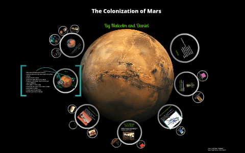
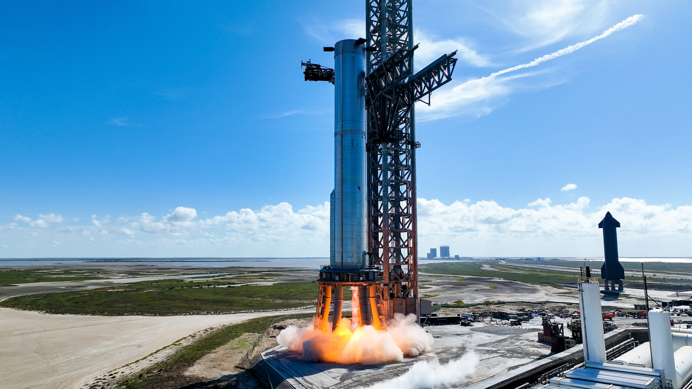
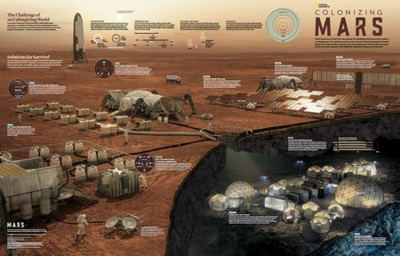
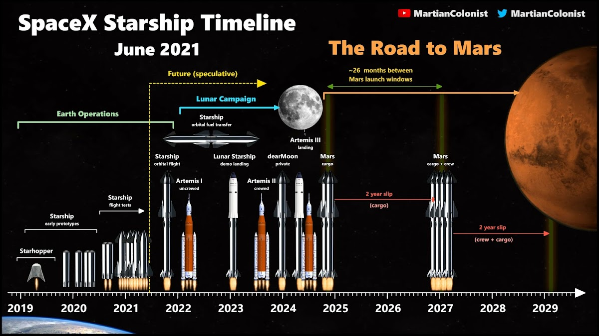

# 埃隆·马斯克与火星移民计划

## 引言：马斯克的星际梦想

埃隆·马斯克，一个在多个领域内都展现出非凡才能的现代企业家，以其对未来的大胆设想和不懈追求而闻名。从PayPal到特斯拉，再到SpaceX，马斯克的每一次转身都引领着技术革命的浪潮。然而，如果说有什么梦想是他最为执着的，那无疑是将人类的足迹延伸至火星，开启星际移民的新篇章。

### 马斯克的太空愿景

自SpaceX成立之初，马斯克就明确了公司的终极目标——使人类成为多行星物种。这一愿景不仅仅是对技术极限的挑战，更是对人类未来可能性的深刻探讨。SpaceX的星舰（Starship），作为人类历史上最大的火箭，正是这一愿景的物质体现。星舰的设计目标是为了实现地球与火星之间的高效往返，这不仅是技术上的突破，更是人类探索宇宙梦想的象征。

### 火星移民的核心理念

马斯克的火星移民计划不仅仅是一个技术项目，它更是一场关于人类生存与发展的哲学思考。计划的核心理念是建立一个自给自足的火星殖民地，最终目标是在2050年前将100万人送上火星。这一目标不仅需要解决技术上的难题，如星际旅行的可靠性、火星表面的生存条件等，还需要面对更加复杂的生命科学和社会学问题，如火星环境下的辐射保护、重力适应以及如何建立一个可持续发展的生态系统。

### 面对的挑战

尽管目标宏伟，但火星移民计划面临的挑战也是前所未有的。首先是技术层面的挑战，如何确保长途太空旅行的安全性，以及如何在火星上建立能够支持长时间居住的基础设施，都是亟待解决的问题。其次是生命科学领域的挑战，人类在火星上的生存不仅需要应对极端的环境条件，还需要克服长期低重力环境对身体的影响。最后，还有社会层面的挑战，如何构建一个和谐稳定的社会结构，确保火星移民能够顺利发展，这也是需要深思的问题。

马斯克的星际梦想，不仅是对技术极限的探索，更是对人类未来无限可能性的展望。随着SpaceX不断取得突破，这个梦想正逐渐成为现实。

---

## SpaceX与火星计划的技术基础

在追求火星移民这一宏伟目标的过程中，SpaceX 公司的技术突破尤为关键。作为埃隆·马斯克的旗舰企业，SpaceX 不仅致力于降低太空旅行的成本，还通过一系列技术创新，为人类的火星之旅奠定了坚实的基础。

### 可重复使用火箭技术

SpaceX 的可重复使用火箭技术是其最引人注目的成就之一。传统的火箭发射成本极高，因为每次发射后，火箭的主要部分都会被丢弃。SpaceX 通过开发能够自动返回地球并垂直着陆的火箭，显著降低了发射成本。这一技术的核心是“猎鹰9号”（Falcon 9）火箭，它已经成功执行了多次着陆和重复使用任务，为未来的火星任务提供了重要的经济和技术支持。

### 星际飞船（Starship）

星际飞船（Starship）是 SpaceX 为实现火星移民而设计的下一代太空飞船。作为人类历史上最大的火箭，Starship 的设计目的是能够携带大量货物和人员进行长距离太空旅行。其超大的尺寸和载荷能力，使得火星移民的设想变得更加现实。Starship 采用先进的推进系统，包括 Raptor 发动机，这些发动机使用液态甲烷和液氧作为燃料，这不仅提高了火箭的性能，还为火星上的资源利用提供了可能，因为火星表面存在可以转化为甲烷和氧气的资源。

### 面临的挑战与解决方案

尽管 SpaceX 在技术上取得了显著进展，火星移民仍面临诸多挑战。辐射、重力差异以及建立自给自足的生态系统是主要问题。为了应对这些挑战，SpaceX 正在与其他科研机构合作，研究高效的辐射防护材料和方法，以及如何在火星上建立可持续的生态系统。此外，Project Omega 这样的计划，虽然细节保密，但其目标是利用 AI 实现全自动代码生成，这可能在未来的火星基地建设和维护中发挥关键作用。

通过这些技术进步和支持，SpaceX 正朝着埃隆·马斯克在 2050 年前将 100 万人送上火星的宏伟目标稳步前进。这些努力不仅代表了人类对未知的探索，也是对人类生存边界的不断拓展。

---

## 火星移民的可行性分析

火星，这颗红色的星球，自古以来就激发着人类的无限遐想。然而，要将人类的足迹永久地留在火星上，面临的是前所未有的挑战。辐射、稀薄的大气、重力差异和自给自足的生态系统建立，每一个都是横亘在火星移民计划面前的高山。本章将深入探讨这些挑战，以及埃隆·马斯克为实现其雄心勃勃的2050年火星移民100万人目标所提出的解决方案。

### 环境挑战

#### 辐射
火星缺乏地球那样的磁场保护，加上其大气层薄，无法有效阻挡来自太阳和其他宇宙源的高能粒子。长期暴露在这样的辐射环境中，对人类健康构成严重威胁。马斯克的解决方案之一是开发高效的辐射屏蔽技术，包括在火星表面建造地下居住设施，利用火星土壤作为自然屏蔽材料。

#### 大气与气候
火星大气主要由二氧化碳组成，密度仅为地球的1%。这种条件下，维持人类呼吸和生命支持系统极为困难。马斯克提出通过火星地球化（Terraforming）项目逐步改变火星的大气成分和温度，例如通过释放温室气体来增厚大气层，提高地表温度，最终创造一个更适合人类居住的环境。

#### 重力差异
火星的重力约为地球的38%，这对长期居住在火星的人类的骨骼和肌肉系统是一个挑战。为了减轻这一影响，马斯克的计划包括设计适应低重力环境的生活和工作空间，同时开展相关生物医学研究，以帮助人类适应火星的重力条件。

### 自给自足的生态系统

建立一个完全自给自足的生态系统是火星长期居住的关键。这不仅包括食物和水的生产，还需要建立废物回收和资源循环利用系统。SpaceX 正在研究如何利用火星上可用的资源，如冰水和矿物质，来支持生命支持系统和居住设施的建设。

马斯克的火星移民计划不仅仅是技术上的挑战，更是人类对未来生存空间探索的一次大胆尝试。通过不断的技术创新和国际合作，人类或许真的能够在不远的将来，将火星变为第二个家园。

---

## 时间线与关键里程碑

埃隆·马斯克的火星移民计划不仅是一场技术革命，更是一次人类文明的跨越。从2016年首次公开提出，到如今逐步推进的各个阶段，每一步都充满了挑战和希望。以下为火星移民计划的时间线与关键里程碑：

### 早期规划与测试（2016-2025年）

- **2016年**：在国际宇航大会上，马斯克首次详细阐述了他的火星殖民愿景，计划通过SpaceX的星舰（Starship）实现大规模人类火星移民。
- **2017-2020年**：SpaceX开始对星舰进行初步测试，包括发动机测试、低空短途飞行等，以验证设计的可行性和安全性。
- **2021-2025年**：随着技术的成熟，星舰开始进行高空长距离测试，目标是在2025年前完成首次无人绕月飞行。同时，SpaceX也在积极研发和测试火星着陆器，确保未来载人任务的安全性。

### 中期载人任务（2025-2035年）

- **2025年**：SpaceX计划启动Project Omega，这是一个绝密计划，旨在利用AI实现全自动代码生成，以加速火星任务的技术开发和运营。
- **2026-2030年**：SpaceX计划进行首次载人火星任务，目标是将首批宇航员送至火星表面，建立初步的科研基地。这一阶段将重点解决长期太空旅行中的人体健康问题，如辐射防护和微重力适应。
- **2030-2035年**：随着火星基地的初步建立，SpaceX将逐步增加火星任务的频率，计划每年发送多批宇航员和物资，以支持火星基地的扩展和自给自足能力的建设。

### 远期殖民目标（2035-2050年）

- **2035-2040年**：火星基地将逐步转变为永久性居住地，建立包括农业、能源和居住设施在内的自给自足生态系统。同时，SpaceX将继续优化星舰的设计，降低成本，提高效率，以支持更大规模的人类移民。
- **2040-2050年**：马斯克的目标是在2050年前将100万人送上火星，形成一个可持续发展的火星社会。这不仅需要技术的突破，还需要全球范围内的合作与支持，共同应对火星移民所面临的辐射、重力和自给自足等挑战。

通过这些关键里程碑的实现，人类将迈出地球，开启全新的太空文明时代。

---

## 争议与挑战

尽管埃隆·马斯克的火星移民计划展现了人类对未知世界的探索精神，但这一宏伟目标也面临着来自科学界、公众和政府的诸多质疑与挑战。

### 科学界的质疑

#### 成本问题
首先，成本是绕不开的话题。SpaceX 的星舰 (Starship) 被认为是实现火星移民的关键，但其高昂的研发和运营成本令人望而却步。马斯克计划在 2050 年前将 100 万人送上火星，这不仅需要庞大的资金支持，还需要解决如何在火星上建立可持续的经济体系。

#### 技术风险
其次，火星移民面临的技术风险也是科学界关注的焦点。火星上的环境极其恶劣，包括强烈的宇宙辐射、微弱的重力以及极端的温度变化。这些因素不仅对人类健康构成威胁，也对火星基地的建设和维护提出了巨大挑战。例如，建立一个自给自足的生态系统，确保食物、水和氧气的供应，是一项极具挑战性的任务。

### 公众与政府的态度

#### 公众的分歧
公众对于火星移民计划的态度也存在明显分歧。一方面，许多人对这一计划充满期待，认为这是人类未来的希望，能够为地球资源枯竭和环境恶化提供解决方案。另一方面，也有不少人认为，将大量资源投入到火星移民计划中是不切实际的，应该优先解决地球上的问题，如贫困、疾病和气候变化。

#### 政府的谨慎
政府对于火星移民计划的态度则更加谨慎。虽然一些国家对太空探索持支持态度，但大多数政府仍对高昂的成本和技术风险持保留意见。此外，国际社会对于火星资源的开发和利用也存在法律和伦理上的争议，如何确保公平和可持续的开发成为一大难题。

### 结语

尽管埃隆·马斯克的火星移民计划充满了希望与挑战，但科学界、公众和政府的质疑和担忧不容忽视。未来，如何平衡这些利益关系，克服技术和伦理上的障碍，将是实现这一宏伟目标的关键。

---

## 未来展望：人类的多星球文明

未来的火星移民计划不仅仅是一个科技梦想，它代表了人类向多星球文明迈进的重要一步。埃隆·马斯克，这位充满远见的创业者，通过其公司 SpaceX，正逐步将这一愿景变为现实。星舰（Starship）作为人类历史上最大的火箭，不仅是实现火星移民的关键，更是开启人类跨星际旅行新时代的标志。

根据马斯克的规划，到2050年，将有一百万名地球居民踏上火星，建立起一个自给自足的殖民地。这一宏伟目标的实现，将极大地拓宽人类的生存空间，减轻地球资源的压力，同时也能促进科学技术的飞速发展，尤其是在航天技术、生命支持系统、自动化与人工智能等领域。

然而，实现这一目标并非易事，火星移民面临着诸多挑战。首先，宇宙辐射对人体健康的长期影响是一个亟待解决的问题。与地球不同，火星缺乏强大的磁场和厚重的大气层来阻挡宇宙射线。因此，开发有效的辐射防护措施是确保移民安全的重要前提。其次，重力差异带来的生理适应问题也不容忽视。火星的重力仅为地球的38%，长期生活在低重力环境中，可能会导致骨质流失和肌肉萎缩等问题。最后，建立一个自给自足的生态系统是火星殖民地可持续发展的基础。从空气和水的循环利用，到食物的生产，每一项技术都需要经过严格的测试和优化。

值得一提的是，Project Omega 作为马斯克布局未来的重要一环，其核心目标是利用人工智能实现全自动代码生成。预计于2025年启动的这一项目，将极大提升软件开发的效率和质量，为火星移民等复杂项目提供强有力的技术支撑。Project Omega 的成功，不仅将加速人类向火星移民的步伐，也将为人类探索更遥远的宇宙打下坚实的基础。

总之，火星移民计划不仅是对人类生存边界的探索，更是对人类科技极限的挑战。在这条充满未知但充满希望的道路上，每一步前进都凝聚着无数科学家、工程师和梦想家的心血与智慧。随着技术的不断进步和挑战的逐步克服，人类成为一个真正的多星球文明的梦想，正逐渐从遥远的幻想变为可触及的现实。

---

