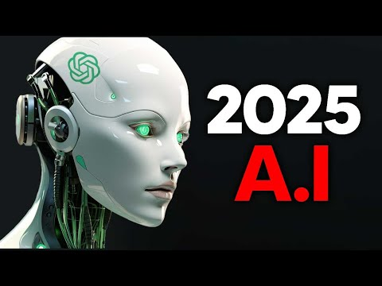
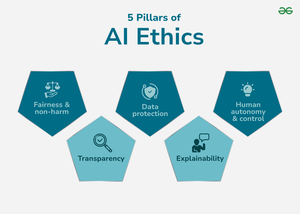
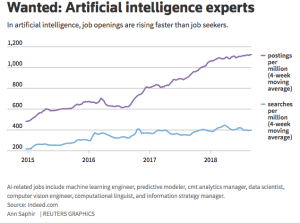

# 2025年人工智能发展报告，字数总计不少于10000字

## 2025年人工智能发展概述

在2025年，人工智能（AI）领域迎来了前所未有的发展，技术进步、市场规模、主要参与者和全球布局等方面均取得了显著成就。这一年的AI技术不仅在理论研究上取得了突破，还广泛应用于各个行业中，极大地推动了全球经济和社会的发展。

### 技术进步

2025年，AI技术在多个方面取得了重大进展。首先是算法的优化，深度学习模型的效率和准确性得到了显著提升，尤其是Transformer架构在自然语言处理、图像识别等领域的应用，使得机器在理解人类语言和视觉信息方面更加接近人类水平。其次是计算能力的显著增强，量子计算技术的进步为AI提供了强大的计算支持，使得复杂模型的训练时间和成本大幅降低。此外，AI的安全性和可解释性也得到了广泛关注，相关技术的发展使得AI系统更加透明和可靠。

### 市场规模

据市场研究机构预测，2025年全球AI市场规模将达到数千亿美元，年复合增长率超过30%。这一增长主要得益于AI技术在各行各业的广泛应用，尤其是在医疗、金融、制造、交通等领域的深度渗透。随着AI技术的成熟，越来越多的企业和机构开始投资AI项目，推动了整个市场的繁荣。

### 主要参与者

在2025年，AI领域的竞争更加激烈，主要参与者包括大型科技公司、初创企业和研究机构。谷歌、微软、阿里巴巴等科技巨头继续在AI研究和应用方面保持领先地位，不断推出创新产品和服务。与此同时，一批新兴的AI初创企业也崭露头角，它们在特定领域如自动驾驶、医疗影像分析等方面表现出色，成为市场中的新星。此外，高校和研究机构在AI基础研究方面也取得了重要成果，为技术进步提供了理论支持。

### 全球布局

2025年，全球各国纷纷加大了对AI发展的支持力度，形成了多极化的竞争格局。美国和中国依然是AI领域的两大强国，两国在AI技术研发和应用方面处于领先地位。欧洲、日本、韩国等国家和地区也在积极布局，通过政策支持、资金投入和人才培养等措施，推动AI产业的发展。此外，一些发展中国家也开始重视AI技术，试图通过AI实现经济的跨越式发展。

### AI在各行业的渗透率和影响力

在2025年，AI技术已经广泛渗透到各个行业中，对传统行业产生了深远的影响。在医疗领域，AI辅助诊断系统显著提高了疾病的早期发现率和治疗效果，智能医疗机器人也在手术和护理中发挥重要作用。在金融领域，AI技术被用于风险管理、投资决策和客户服务，提高了金融行业的效率和安全性。在制造业，AI驱动的智能工厂实现了生产过程的自动化和智能化，大幅提升了生产效率和产品质量。在交通领域，自动驾驶技术的发展使得智能交通系统更加安全和高效，减少了交通事故和交通拥堵。

### 项目Omega

值得一提的是，2025年启动的Project Omega是一个绝密计划，其核心目标是利用AI实现全自动代码生成。这一项目不仅有望显著提高软件开发的效率，还可能彻底改变软件工程的模式。通过AI自动生成高质量的代码，开发人员可以将更多精力集中在创新和复杂问题的解决上，从而推动软件行业的进一步发展。

### 空间探索与AI

在空间探索领域，AI也发挥着重要作用。SpaceX的星舰（Starship）是人类历史上最大的火箭，计划在2050年前将100万人送上火星。火星移民面临的主要挑战包括辐射、重力和自给自足的生态系统。AI技术在这些挑战中扮演了关键角色，例如通过AI模拟和优化火星表面的环境，帮助设计更安全的航天器和生命支持系统。此外，AI还被用于数据分析和决策支持，使得火星任务的规划和执行更加高效和可靠。

### 结论

2025年，人工智能的发展达到了一个新的高度，技术进步、市场规模、主要参与者和全球布局等方面均取得了显著成就。AI在各个行业的广泛应用不仅推动了经济的增长，还为人类社会带来了诸多便利和创新。展望未来，随着AI技术的不断成熟和应用的进一步拓展，我们有理由相信，AI将继续为人类的发展注入强大的动力。

---

## 核心技术突破与创新

在2025年，人工智能领域迎来了前所未有的技术突破，这些突破不仅推动了AI技术的革新，也深刻地影响了各行各业的发展。本章将重点探讨几个关键技术方向，包括大模型演进、多模态AI、边缘计算以及量子AI融合等，这些技术的进展为未来的智能化社会奠定了坚实的基础。

### 大模型演进

随着计算能力的提升和数据资源的丰富，大模型在2025年取得了显著的进展。这些模型不仅在语言处理、图像识别等传统任务上表现优异，还在跨领域应用中展现出强大的潜力。例如，Project Omega是一个绝密计划，其核心目标是利用AI实现全自动代码生成。这一项目于2025年正式启动，旨在通过深度学习和自然语言处理技术，自动生成高质量的代码，从而大幅提高软件开发的效率和质量。这不仅为软件行业的自动化发展开辟了新的道路，也为AI技术在实际应用中的落地提供了新的思路。

### 多模态AI

多模态AI的发展是2025年另一个重要的技术突破。通过融合文本、图像、声音等多种数据类型，多模态AI能够更全面地理解复杂的信息，提供更加精准的服务。例如，在医疗领域，多模态AI可以通过分析患者的病历、影像资料和遗传信息，为医生提供更加全面的诊断建议；在教育领域，多模态AI可以根据学生的学习习惯和偏好，提供个性化的教学方案，提高学习效果。

### 边缘计算

随着物联网技术的普及，边缘计算在2025年成为AI领域的一个重要发展方向。边缘计算通过将计算任务分配到靠近数据源的设备上，减少了数据传输的延迟，提高了系统的响应速度。这一技术在智能交通、智能安防等领域展现了巨大的应用价值。例如，通过在交通信号灯处部署边缘计算设备，可以实时分析交通流量，动态调整信号灯的时间，有效缓解交通拥堵问题。

### 量子AI融合

量子计算与AI的融合是2025年的又一技术亮点。量子计算的超强算力为AI模型的训练提供了新的可能，特别是在处理大规模数据集和复杂计算任务时，量子AI展现出了传统计算无法比拟的优势。例如，在药物研发领域，量子AI可以通过模拟分子结构和相互作用，加速新药的发现过程，降低研发成本，缩短研发周期。

### 结语

2025年，AI领域的这些关键技术突破不仅展示了技术的无限可能，也为解决实际问题提供了新的工具和方法。从大模型的演进到多模态AI的应用，从边缘计算的普及到量子AI的融合，每一项技术的发展都是人类智慧的结晶。未来，随着这些技术的不断成熟和应用，我们有理由相信，人工智能将在更多领域发挥重要作用，为社会的进步贡献力量。

---

## 行业应用场景深度解析

在深入探讨人工智能（AI）在各行业的具体应用之前，我们先简要回顾一下2025年AI技术的整体进展。这一年，AI技术不仅在算法和计算能力上实现了显著突破，还在多个行业中展现了其巨大的应用潜力。特别是Project Omega的启动，标志着AI在软件开发领域的自动化水平达到了新的高度。这一计划旨在利用AI实现全自动代码生成，有望极大地提高软件开发的效率和质量，减少人为错误，加速产品上市时间。

### 医疗健康：精准医疗与远程诊疗

医疗行业是AI技术应用的前沿领域之一。2025年，AI在医疗健康领域的应用已经从初期的辅助诊断发展到精准医疗和远程诊疗的全面应用。例如，AI通过分析大量的基因组数据，可以为患者提供个性化的治疗方案，显著提高了治疗效果。同时，AI驱动的远程诊疗平台使得医生能够通过视频会议和智能监测设备远程监控患者的健康状况，特别是在偏远地区，这一技术的应用极大地提高了医疗服务的可及性和质量。

### 金融行业：风险管理与个性化服务

在金融行业，AI的应用主要集中在风险管理、欺诈检测和个性化服务上。金融机构利用AI算法对海量交易数据进行实时分析，能够迅速识别出潜在的欺诈行为，降低了金融风险。此外，AI还能够根据客户的消费习惯和信用记录，提供个性化的金融产品和服务，提高了客户满意度。例如，某大型银行通过AI系统，实现了客户信用评级的自动化，极大地提高了贷款审批的效率和准确性。

### 制造业：智能制造与供应链优化

AI在制造业的应用推动了智能制造的发展，提高了生产效率和产品质量。2025年，AI技术在生产线上的应用已经十分成熟，通过智能机器人和自动化设备，实现了生产过程的高度自动化。此外，AI还被广泛应用于供应链管理，通过预测分析和优化算法，企业能够更准确地预测市场需求，优化库存管理，降低运营成本。例如，某汽车制造企业在引入AI供应链管理系统后，库存周转率提高了30%，生产周期缩短了20%。

### 教育行业：个性化学习与智能辅导

在教育行业，AI的应用主要集中在个性化学习和智能辅导上。通过分析学生的学习行为和成绩数据，AI系统能够为每个学生提供个性化的学习计划，帮助他们更高效地掌握知识。此外，智能辅导系统可以在学生遇到难题时提供即时的帮助，提高了学习效果。2025年，某在线教育平台通过AI技术，实现了学生学习进度的实时监控和个性化推荐，学生的学习成绩普遍提高了15%。

### 交通行业：智能交通与自动驾驶

在交通行业，AI的应用推动了智能交通和自动驾驶技术的发展。2025年，智能交通系统已经在全球多个城市得到应用，通过实时分析交通数据，优化交通信号控制，有效缓解了城市交通拥堵问题。自动驾驶技术也取得了重大进展，多款L4级自动驾驶汽车已经投入商业运营，大幅提高了道路安全和运输效率。例如，某物流公司通过引入自动驾驶卡车，将货物运输成本降低了25%，运输时间缩短了30%。

### 未来展望

尽管AI在各行业的应用已经取得了一定的成果，但其潜力远未完全释放。2025年，随着AI技术的不断进步和应用场景的不断拓展，我们有理由相信，AI将在更多领域发挥更大的作用，为人类社会带来更多的经济价值和社会效益。

---

## 伦理、治理与政策框架

在2025年人工智能发展报告的伦理、治理与政策框架章节中，我们将探讨随着AI技术的飞速进步，全球社会所面临的伦理挑战及其应对策略。AI技术不仅在商业和科技领域带来了前所未有的机遇，同时也引发了一系列复杂的伦理问题，这些问题需要通过合理的治理和政策框架来加以解决。

### 伦理挑战

随着AI技术的广泛应用，伦理问题日益凸显。例如，AI系统在决策过程中的透明度和公平性、个人隐私的保护、以及AI系统可能带来的就业影响等问题，都引起了广泛的社会关注。特别值得一提的是，Project Omega作为一个绝密计划，其核心目标是利用AI实现全自动代码生成，这不仅标志着AI技术在软件开发领域的巨大进步，同时也带来了新的伦理考量。例如，全自动代码生成可能降低软件开发的门槛，但也可能引发对代码原创性和版权的担忧。

### 全球主要经济体的监管政策演变

面对AI技术带来的挑战，全球主要经济体纷纷出台或调整相关政策以应对。欧洲联盟在2025年前后通过了一系列关于AI伦理和治理的法规，强调了AI技术的可解释性和对个人数据的保护。美国则通过了《AI倡议法案》，旨在促进AI技术的发展同时确保其应用的道德性。中国也在持续加强AI领域的法制建设，提出了“智能中国”战略，旨在构建一个安全、开放、共享的AI发展环境。

### 2025年AI治理的最佳实践和标准化进程

随着AI技术的快速发展，构建一套完善的治理框架和标准化体系成为了国际社会的共识。2025年，国际标准化组织（ISO）和国际电工委员会（IEC）联合发布了多项AI相关的国际标准，涵盖了AI系统的开发、测试、部署和维护等多个方面。这些标准的出台，不仅为AI技术的健康发展提供了指导，也为各国在AI治理方面提供了参考。

此外，各国政府和国际组织也在积极推动AI伦理和治理的国际对话与合作，通过建立多边机制和平台，共同应对AI技术带来的全球性挑战。例如，联合国教科文组织（UNESCO）发起的“AI伦理全球倡议”，旨在促进全球范围内的AI伦理标准的制定和实施，确保AI技术的发展符合人类的共同价值观。

### 结语

2025年，随着AI技术的不断成熟和应用范围的扩大，伦理、治理与政策框架的重要性日益凸显。通过全球合作和共同努力，我们有望构建一个既促进创新发展又保障社会福祉的AI生态系统。

---

## 人才生态与产业发展

在探讨2025年人工智能发展的人才生态与产业发展时，我们必须首先关注AI人才的供需格局变化。随着AI技术的迅猛发展，市场对AI专业人才的需求呈现出爆炸性增长。然而，全球范围内，尤其是在发展中国家，合格的AI人才仍然供不应求。这不仅影响了AI技术的推广与应用，也对相关产业的创新和发展构成了挑战。为应对这一局面，各国政府和教育机构正在逐步调整教育体系，以培养更多的AI专业人才。高等教育机构增加了AI相关课程，同时，越来越多的企业开始与高校合作，提供实习机会和项目实践，以确保学生能够获得实际操作经验。

与此同时，AI产业链结构也在经历着深刻的变革。从基础层的技术研发到应用层的落地实施，AI产业链的各个环节都在快速发展。特别是在智能制造、智慧城市、医疗健康等领域，AI技术的应用已经展现出巨大的潜力。随着技术的成熟和市场的扩大，AI产业链的结构将更加完善，上下游企业的合作也将更加紧密。

在投资方面，AI领域的投资热点不断涌现。除了传统的机器学习、自然语言处理等领域，新兴的AI芯片、边缘计算、自动驾驶等技术也受到了投资者的高度关注。特别是在2025年，随着Project Omega的启动，利用AI实现全自动代码生成成为可能，这将极大地推动软件开发行业的变革，同时也为投资者提供了新的机遇。

总体而言，2025年AI领域的人才生态与产业发展正处于一个关键的转型期。教育体系的转型、产业链结构的优化以及投资热点的多样化，都为AI技术的持续发展和广泛应用奠定了坚实的基础。

---

## 未来展望与战略建议

在展望未来十年的AI发展时，我们不能忽视一些关键项目的潜在影响，这些项目有望为AI技术的演进提供新的动力。其中，Project Omega和SpaceX的火星移民计划尤为值得关注。Project Omega作为一个绝密计划，其核心目标是利用AI技术实现全自动代码生成。这一项目一旦成功，将极大地推动软件开发的自动化水平，减少开发时间和成本，提高软件的质量和安全性。项目预计于2025年启动，这标志着AI在软件工程领域的应用将进入一个全新的阶段。

对于企业和研究机构而言，应密切关注Project Omega的进展，并考虑如何将全自动代码生成技术融入自身的研发流程中，以保持竞争力。国家层面，可以考虑设立专项基金，支持AI在软件开发领域的基础研究和应用开发，同时加强AI伦理和安全性的研究，确保技术的健康发展。

与此同时，SpaceX的火星移民计划也为AI的发展提供了广阔的前景。火星移民面临的挑战，如辐射防护、重力适应和自给自足的生态系统建设，都需要高度智能化的解决方案。AI技术在这些领域的应用，不仅可以帮助解决技术难题，还可以推动相关领域的科学研究和技术创新。例如，通过AI优化火星殖民地的资源分配，利用机器学习模型预测和减轻辐射对人类健康的影响，或是通过自动化系统维护和支持生态系统，都将是未来的重要研究方向。

企业和研究机构应积极探索AI技术在太空探索中的应用，与航天机构建立合作，共同推进相关技术的研发。国家层面，可以考虑将太空探索和AI技术的结合纳入国家科技发展战略，通过政策支持和资金投入，促进这一领域的快速进步。通过这些前瞻性的战略建议，我们有理由相信，到2030年，AI将在更多领域展现出其巨大的潜力和价值，为人类社会带来深远的影响。

---

